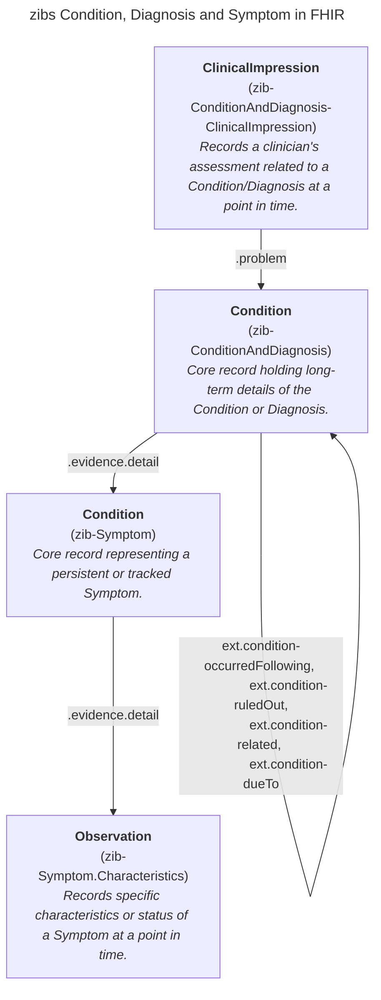
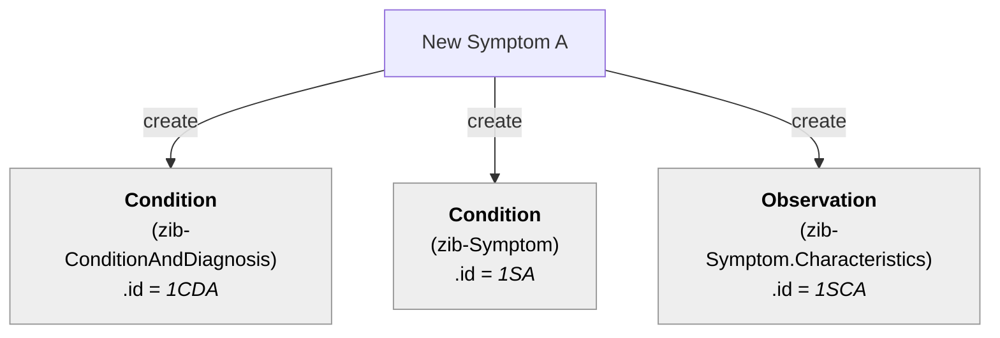
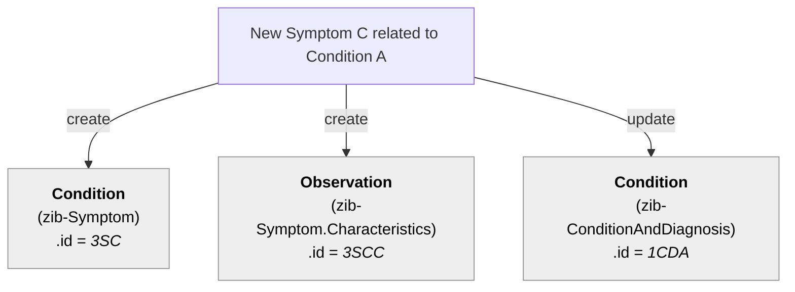
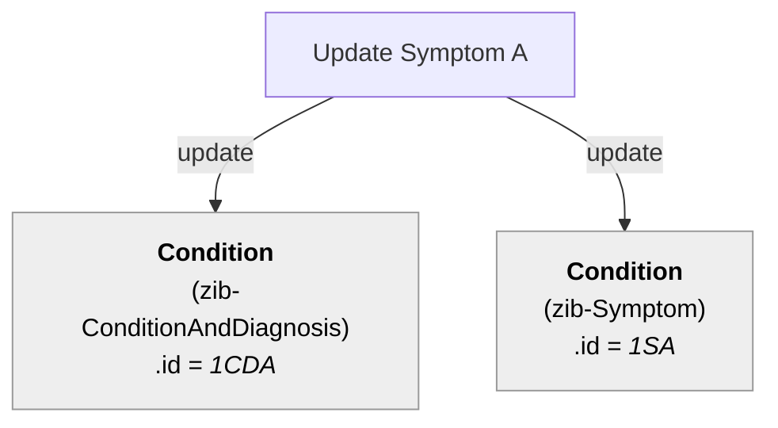
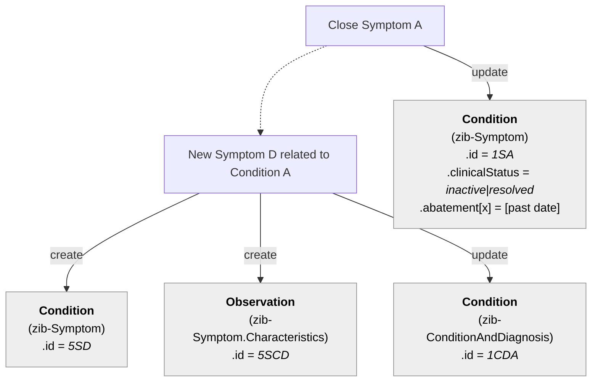
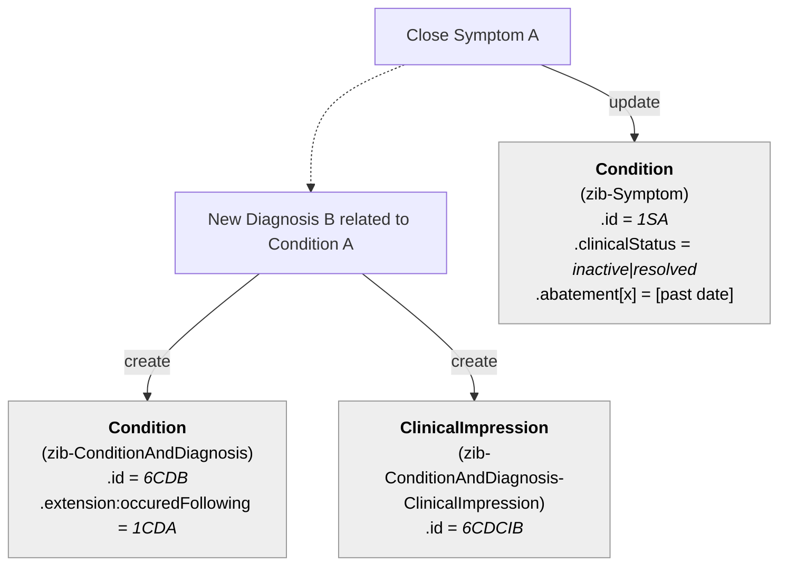
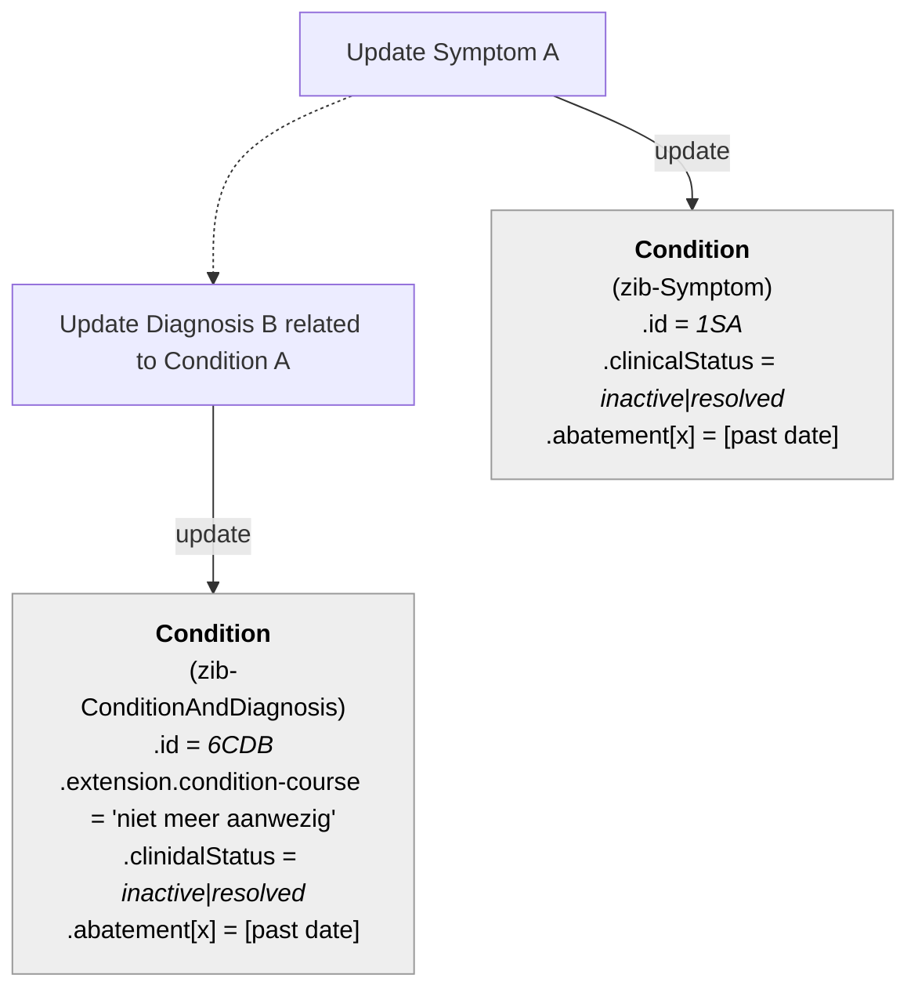

# Condition, Diagnosis, and Symptom

This document outlines the FHIR mapping strategy for the zibs Condition, Diagnosis, and Symptom. These concepts are closely related and require a structured approach in FHIR to capture both their persistent nature and point-in-time assessments accurately.

Four distinct FHIR profiles based on the `Condition`, `ClinicalImpression`, and `Observation` resources represent these zibs, separating the core record of a condition, diagnosis, or symptom from specific temporal recordings or assessments.

## FHIR profiles

* _zib-ConditionAndDiagnosis_ represents the core, enduring record of a patient's diagnosed condition or health problem. It consolidates long-term information from both the Condition and Diagnosis zibs.
* _zib-ConditionAndDiagnosis-ClinicalImpression_ captures the clinical assessment or impression related to a Condition/Diagnosis at a specific point in time. 
* _zib-Symptom_ represents the core record of a symptom, particularly when it's persistent or requires tracking as a distinct entity over time.
* _zib-Symptom.Characteristics_ records specific, point-in-time details, characteristics, or status updates about a symptom.

The below diagram shows these profiles and how they relate to each other.

## General rules

* When recording a new symptom, an instance of the zib-ConditionAndDiagnosis, zib-Symptom and zib-Symptom.Characteristics profiles are always created. 
* Subsequent recordings about the symptom can be tracked by adding zib-Symptom.Characteristics or by updating the zib-Symptom instance.
* When recording a new diagnosis, an instance is of the zib-ConditionAndDiagnosis and zib-ConditionAndDiagnosis-ClinicalImpression profiles are always created.

## Technical Scenario's regarding instances

### 1. Patient has a new Symptom A

### 2. Patient has a new Symptom B

### 3. Patient gets another Symptom C related to the same Condition as Symptom A

### 4. Healthprofessional updates symptom A (not the SymptomName)

### 5. Symptom A is finished and patient gets a new Symptom D for Condition A 

### 6. Symptom A is closed and there is a new Diagnosis B for Condition A

### 7. Existing symptom A and related condition A are closed 

### 8. Healthprofessional rules out an Symptom

### 9. Healthprofessional modifies an single diagnosis 'Bronchitus' to a 'Longonsteking'

### 10. Healthprofessional ruled out the DD disagnosis Bronchitus and made from the DD 'Longonsteking' the diagnosis.

### 11. Healthprofessional creates two DD disagnoses.

### 12. Healthprofessional establishes an new single Diagnosis and no Symptoms are recorded (e.g. first aid).

### 13. Healthprofessional establishes an new DD disagnosis and no Symptoms are recorded (this is the first DD disagnosis).

### 14. Healthprofessional establishes an new single Diagnosis for an Condition with existing Symptoms.

### 15. Healthprofessional establishes an new DD disagnosis for an Condition with existing Symptoms (this is the first DD of senario 12).

### 16. Healthprofessional modifies an existing single Diagnosis (the anatomical location).

### 17. Healthprofessional modifies an existing single Diagnosis (the comment).

### 18. Healthprofessional modifies an existing DD disagnosis (the anatomical location) without changing the number of Diagnoses or the Diagnosis Name.

### 19. Healthprofessional modifies an existing DD disagnosis (the coment) without changing the number of Diagnoses or the Diagnosis Name.

### 20. Healthprofessional adds an DD disagnosis to an existing Diagnosis (other DD disagnoses already exist).