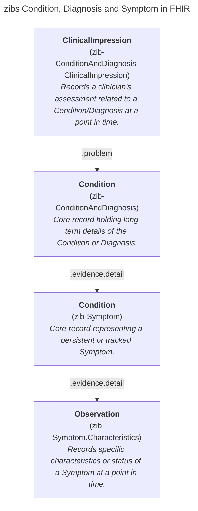
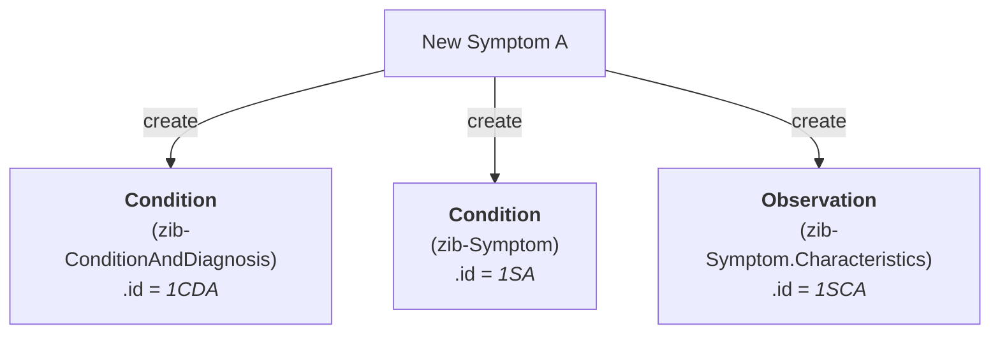
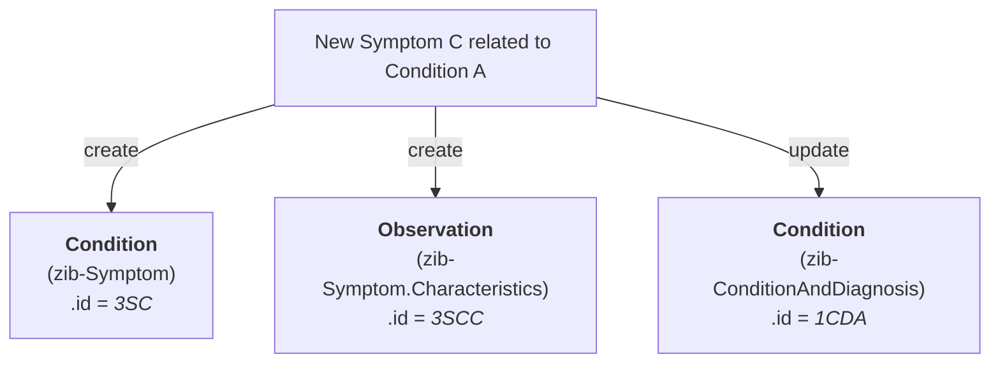
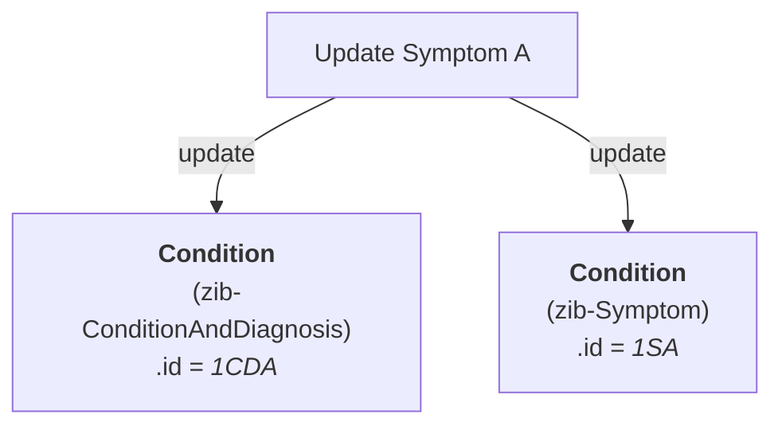
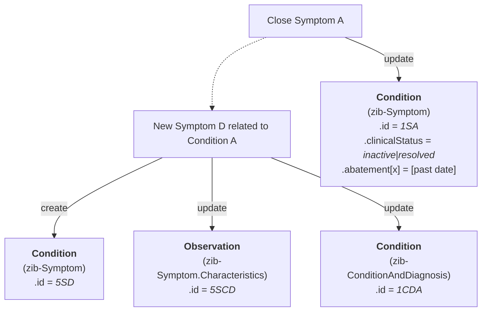
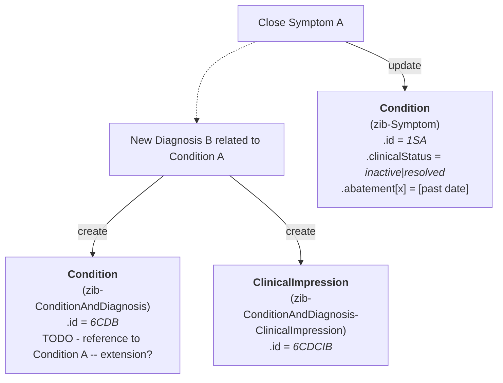

# Condition, Diagnosis, and Symptom

This document outlines the FHIR mapping strategy for the Dutch Zorginformatiebouwstenen (zib) concerning Condition, Diagnosis, and Symptom. These concepts are closely related and require a structured approach in FHIR to capture both their persistent nature and point-in-time assessments accurately.

We utilize four distinct FHIR profiles based on the Condition, ClinicalImpression, and Observation resources to represent this information, separating the core record of a condition, diagnosis, or symptom from specific temporal recordings or assessments.

## FHIR profiles

* zib-ConditionAndDiagnosis (based on Condition): Represents the core, enduring record of a patient's diagnosed condition or health problem. It consolidates long-term information from both the Condition and Diagnosis zibs.
* zib-ConditionAndDiagnosis-ClinicalImpression (based on ClinicalImpression): Captures the clinical assessment or impression related to a Condition/Diagnosis at a specific point in time. 
* zib-Symptom (based on Condition): Represents the core record of a symptom, particularly when it's persistent or requires tracking as a distinct entity over time.
* zib-Symptom.Characteristics (based on Observation): Records specific, point-in-time details, characteristics, or status updates about a symptom.

## General rules

* When recording a new symptom, always an instance is created of the zib-ConditionAndDiagnosis, zib-Symptom and zib-Symptom.Characteristics profiles. 
* Subsequent recordings about the this symptom can be tracked added using zib-Symptom.Characteristics or by updating the zib-Symptom instance.

## Technical Scenario's regarding instances

### 1. Patient has a new Symptom A

### 2. Patient has a new Symptom B

### 3. Patient gets another Symptom C related to the same Condition as Symptom A

### 4. Healthprofessional updates symptom A (not the SymptomName)

### 5. Symptom A is finished and new Symptom D for Condition A 

### 6. Symptom A is closed and there is new Diagnosis B for the Condition A

### 7. Existins symptom A and related condition A are closed 
