# Condition, Diagnosis, and Symptom

This document outlines the FHIR mapping strategy for the zibs Condition, Diagnosis, and Symptom. These concepts are closely related and require a structured approach in FHIR to capture both their persistent nature and point-in-time assessments accurately.

Four distinct FHIR profiles based on the `Condition`, `ClinicalImpression`, and `Observation` resources represent these zibs, separating the core record of a condition, diagnosis, or symptom from specific temporal recordings or assessments.

## FHIR profiles

* _zib-ConditionAndDiagnosis_ represents the core, enduring record of a patient's diagnosed condition or health problem. It consolidates long-term information from both the Condition and Diagnosis zibs.
* _zib-ConditionAndDiagnosis-ClinicalImpression_ captures the clinical assessment or impression related to a Condition/Diagnosis at a specific point in time. 
* _zib-Symptom_ represents the core record of a symptom, particularly when it's persistent or requires tracking as a distinct entity over time.
* _zib-Symptom.Characteristics_ records specific, point-in-time details, characteristics, or status updates about a symptom.

The below diagram shows these profiles and how they relate to each other.
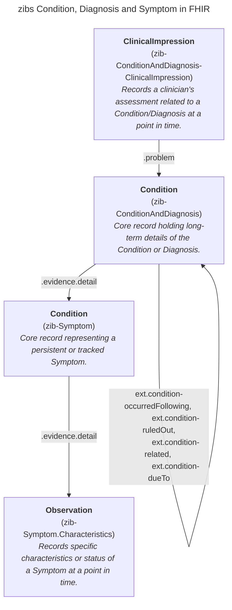

## General rules

* When recording a new symptom, an instance of the zib-Symptom, zib-Symptom.Characteristics, and zib-ConditionAndDiagnosis profiles must be created/present. 
* When recording a new diagnosis, an instance is of the zib-ConditionAndDiagnosis and zib-ConditionAndDiagnosis-ClinicalImpression profiles are created.
* When modifying a symptom instance, all concepts may be updated, except for the _SymptomName_. A change to the _SymptomName_ is considered a new symptom and therefore requires a new instance of both the zib-Symptom and zib-Symptom.Characteristics profiles.
* When modifying a diagnosis instance, all concepts may be updated, except for the _DiagnosisName_. A change to the _DiagnosisName_ is considered a new diagnosis and therefore requires a new instance of both the zib-ConditionAndDiagnosis and zib-ConditionAndDiagnosis-ClinicalImpression profiles.

## Specific guidelines

* When the condition is resolved (i.e. the patient no longer experiences it), the `.clinicalStatus` is set to _inactive_ and the `.abatement[x]` is included.
* Diagnosis concepts are mapped in both zib-ConditionAndDiagnosis and zib-ConditionAndDiagnosis-ClinicalImpression profiles. However, the concepts _MethodOfConfirmation_ (NL-CM:5.6.5), _Comment_ (NL-CM:5.6.11), and _Condition_ (NL-CM:5.6.10) are mapped only in zib-ConditionAndDiagnosis. Conversely, the concepts in the _Reason_ container (NL-CM:5.6.13), _IsComplication_ (NL-CM:5.6.12), _AnatomicalLocation_ (NL-CM:5.6.9), and _DiagnosisStatus_ (NL-CM:5.6.4) are mapped only in zib-ConditionAndDiagnosis-ClinicalImpression.
* When a diagnosis is ruled out based on clinical judgment, the `.verificationStatus` is set to _refuted_. 
* When a single diagnosis is refuted and replaced by another, the `extension:condition-occurredFollowing` is included in the new zib-ConditionAndDiagnosis instance to reference the refuted diagnosis. This creates a clear, traceable sequence between the diagnosis instances.
* When two or more differential diagnoses are added, multiple zib-ConditionAndDiagnosis instances are created, one for each differential diagnosis,  as well as a single instance of zib-ConditionAndDiagnosis-ClinicalImpression. In this ClinicalImpression `.problem` references the differential diagnoses, while `.finding` includes their names (DiagnosisName). If additional differential diagnoses are added later, new zib-ConditionAndDiagnosis instances are created accordingly, and one zib-ConditionAndDiagnosis-ClinicalImpression instance is added. This new ClinicalImpression again uses `.problem` and `.finding` to reference and describe the newly added differential diagnoses.
* When a differential diagnosis is added, the `.extension:condition-related` is included in the zib-ConditionAndDiagnosis instance to reference the other related differential diagnoses. This establishes a link between them.
* When a differential diagnosis is refuted, the `.extension:condition-ruledOut` is included in the remaining differential diagnoses to indicate the refuted diagnosis.
* TODO Symptom uitsluiten en aflsuiten

## General example of clinical flow with 4 moments of recordings

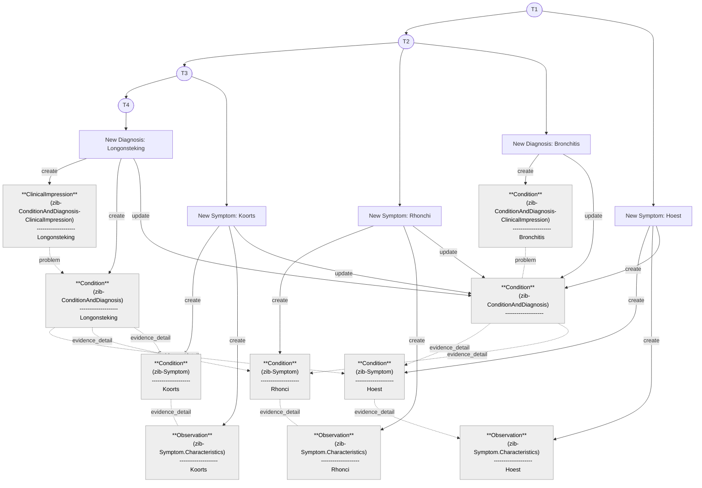

## Technical Scenario's regarding instances

### 1. Patient has a new Symptom A

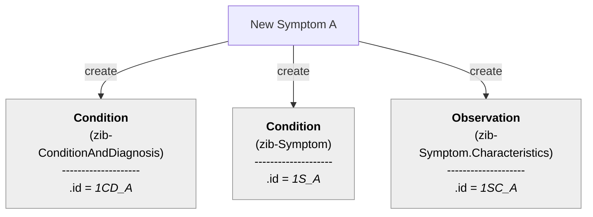

### 2. Patient has a new Symptom B
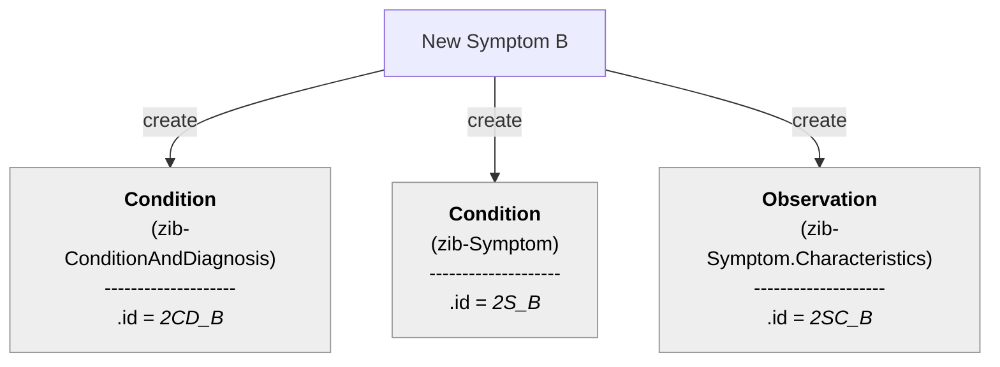

### 3. Patient gets another Symptom C related to the same Condition as Symptom A
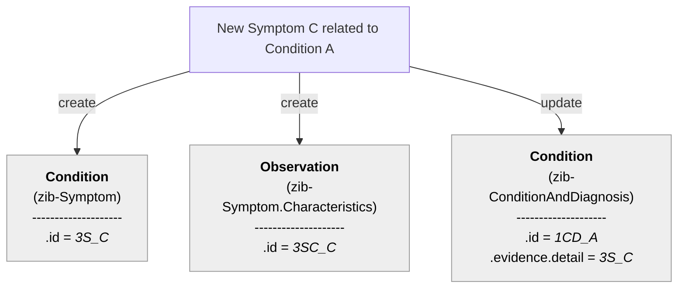

### 4. Healthprofessional adds new recording/observation of an existing Symptom C.
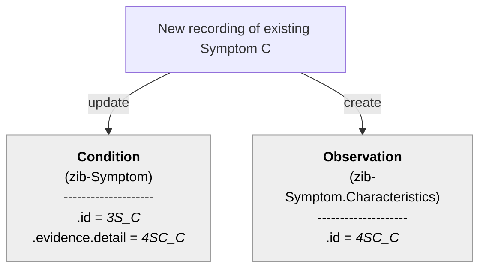

### 5. Healthprofessional updates the anatomical location of symptom A
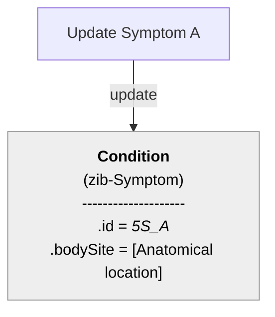

### 6. Symptom A has resolved and patient gets a new Symptom D for Condition A 

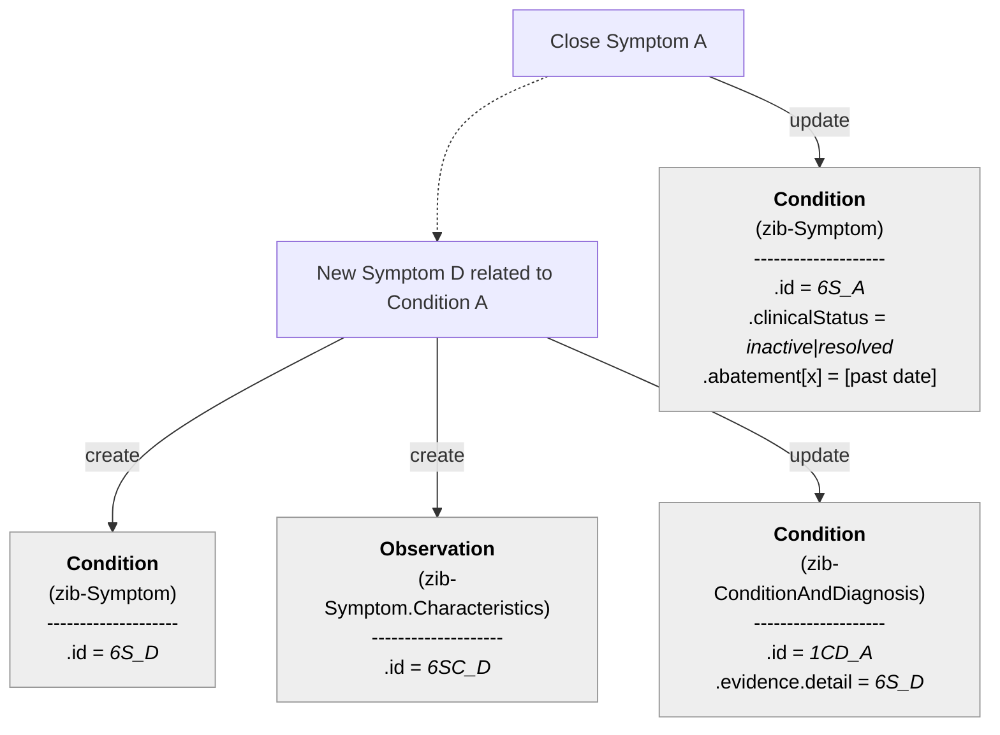

### 7. Symptom A has resolved and there is a new Diagnosis B for Condition A 

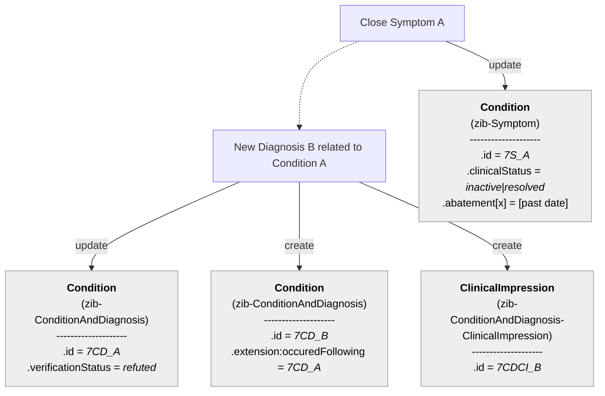

### 8. Symptom A has resolved along with the related condition A?

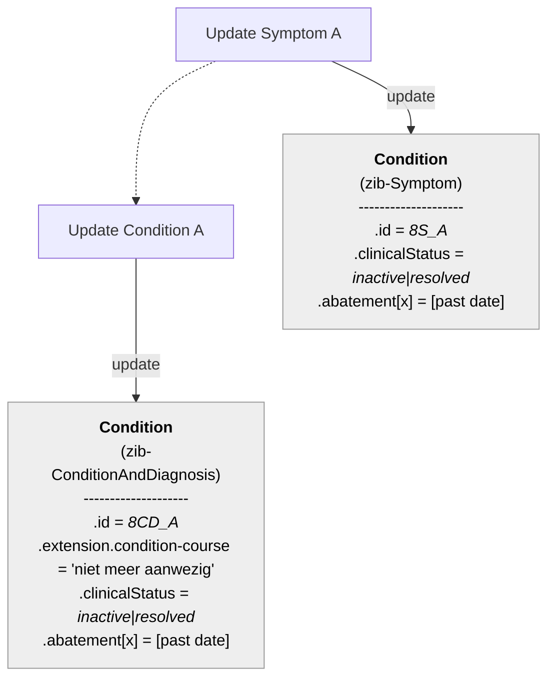

### 9. Healthprofessional rules out Symptom B for Condition A?

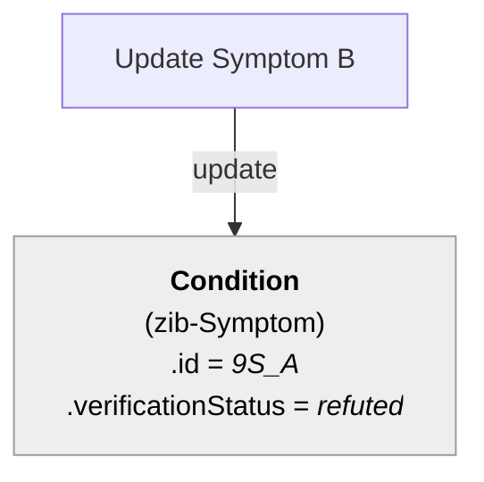

### 10. Healthprofessional modifies a single diagnosis 'Bronchitus' to a Pneumonia

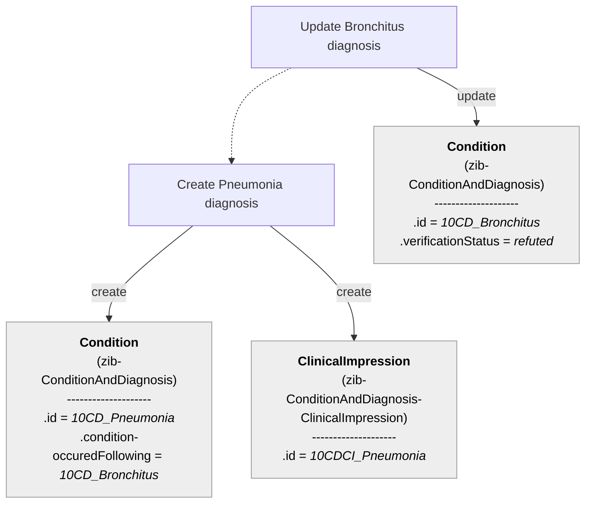

### 11. Healthprofessional ruled out the DD Bronchitus and made from the DD Pneumonia the diagnosis.

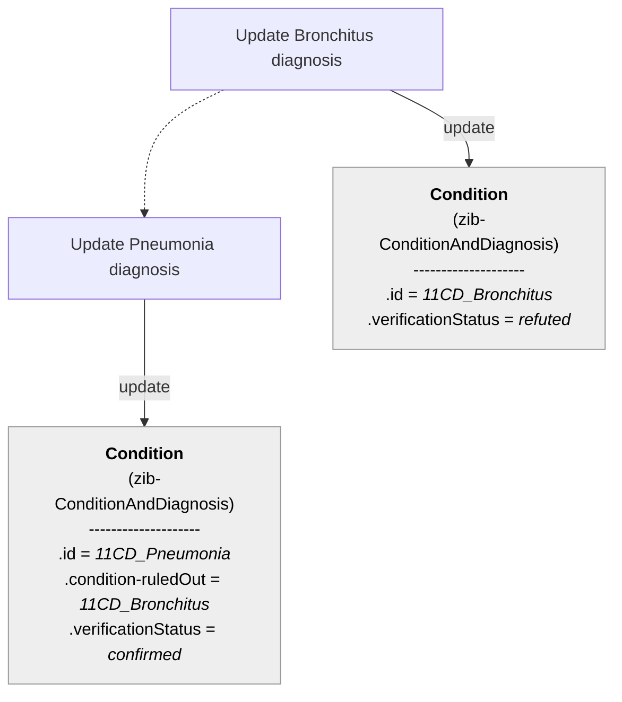

### 12. Healthprofessional creates two differential disagnoses.

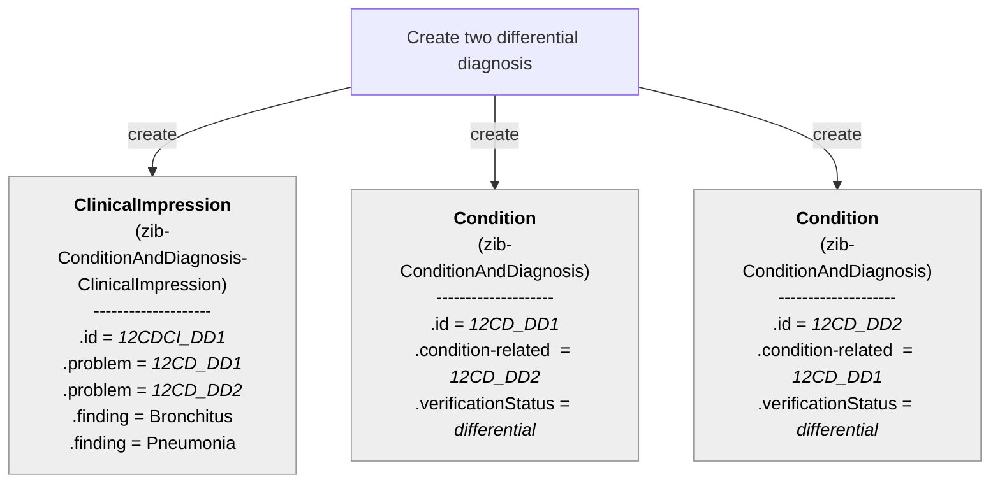

### 13. Healthprofessional establishes a new single Diagnosis A and no Symptoms are recorded (there are no previous diagnoses).

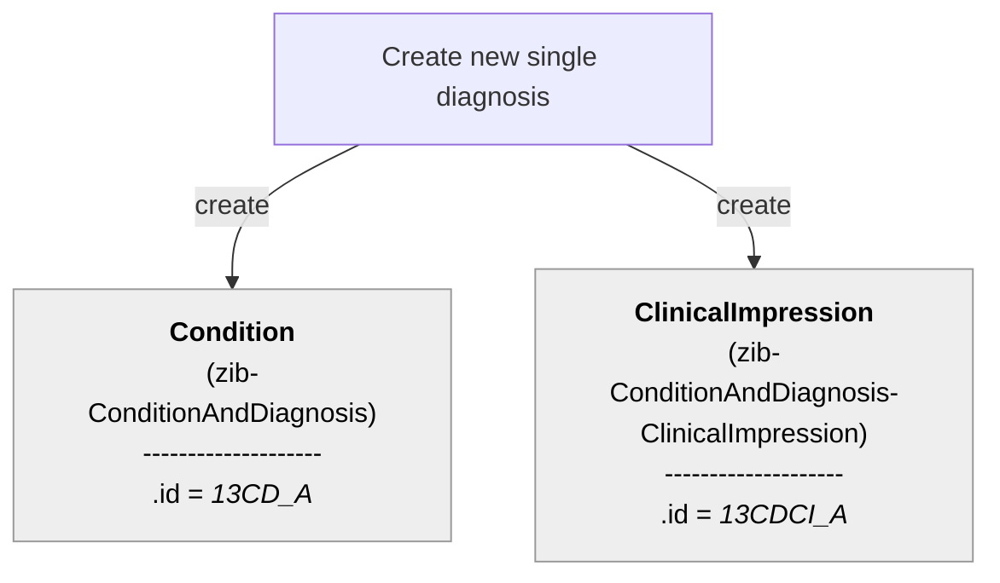

### 14. Healthprofessional establishes a new DD E and no Symptoms are recorded (there are no related DD).

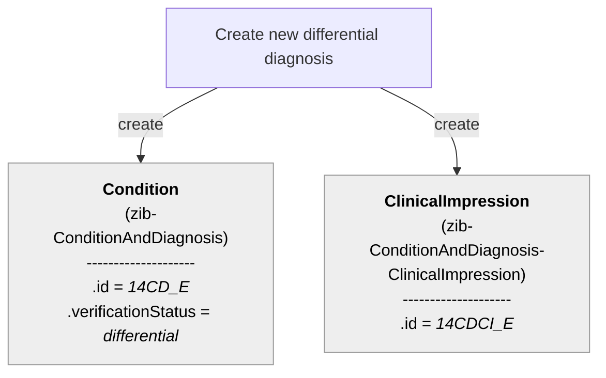

### 15. Healthprofessional establishes a new single Diagnosis for a Condition with existing Symptoms.

TODO

### 16. Healthprofessional establishes a new DD  diagnosis for a Condition with existing Symptoms (this is the first DD of senario 12).

### 17. Healthprofessional modifies a existing single Diagnosis (the anatomical location).

### 18. Healthprofessional modifies a existing single Diagnosis (the comment).

### 19. Healthprofessional modifies a existing DD  diagnosis (the anatomical location) without changing the number of Diagnoses or the Diagnosis Name.

### 20. Healthprofessional modifies a existing DD  diagnosis (the coment) without changing the number of Diagnoses or the Diagnosis Name.

### 21. Healthprofessional adds a DD  diagnosis to a existing Diagnosis (other DD disagnoses already exist).

### 23. Scneario's of Astrid (pp)

