# The HCIM's Condition, Diagnosis, and Symptom

## Introduction
This document outlines the FHIR mapping strategy for the HCIM's Condition, Diagnosis, and Symptom. These concepts are closely related and require a structured approach in FHIR to capture both their persistent nature and point-in-time assessments accurately.

Four distinct FHIR profiles based on the `Condition`, `ClinicalImpression`, and `Observation` resources represent these HCIM's, separating the core record of a condition, diagnosis, or symptom from specific temporal recordings or assessments.

## FHIR profiles

* _zib-ConditionAndDiagnosis_ represents the core, enduring record of a patient's diagnosed condition or health problem. It consolidates long-term information from both the Condition and Diagnosis HCIM's.
* _zib-ConditionAndDiagnosis-ClinicalImpression_ captures the clinical assessment or impression related to a Condition/Diagnosis at a specific point in time. 
* The Symptom HCIM can be represented using either an Observation or a Condition. It is up to the user to choose the approach that best fits their needs. General guidelines include:
    * _zib-Symptom_ represents the core record of a symptom, particularly when it's specific data to support the presence/absence of a diagnosed condition.
    * _zib-Symptom-Condition_ represents the core record of a symptom, particularly when no etiology has been identified or when it requires tracking as a distinct entity over time.
    * _zib-Symptom.Characteristics_ records specific, point-in-time details, characteristics, or status updates about a symptom. This profile should only be used in combination with the focal resource _zib-Symptom-Condition_.   

The below diagram shows these profiles and how they relate to each other.
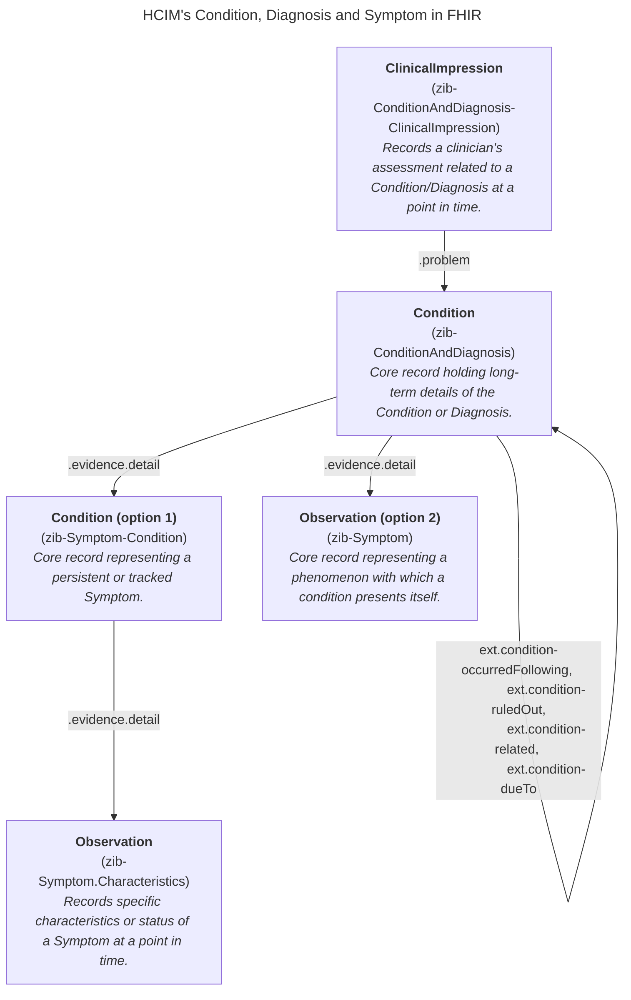
```mermaid
---
title: HCIM's Condition, Diagnosis and Symptom in FHIR
---

flowchart TB

    CD["`**Condition**
        (zib-ConditionAndDiagnosis)
        _Core record holding long-term details of the Condition or Diagnosis._`"]
    CDCI["`**ClinicalImpression**
        (zib-ConditionAndDiagnosis-ClinicalImpression)
        _Records a clinician's assessment related to a Condition/Diagnosis at a point in time._`"]
    S["`**Condition (option 1)**
        (zib-Symptom-Condition)
        _Core record representing a persistent or tracked Symptom._`"]
    SO["`**Observation (option 2)**
        (zib-Symptom)
        _Core record representing a phenomenon with which a condition presents itself._`"]
    SC["`**Observation**
        (zib-Symptom.Characteristics)
        _Records specific characteristics or status of a Symptom at a point in time._`"]    

    %% --- Relationships ---
    CD -- .evidence.detail --> SO 
    CD -- .evidence.detail --> S  
    CDCI    -- .problem --> CD
    S       -- .evidence.detail --> SC
    CD      -- ext.condition-occurredFollowing, 
               ext.condition-ruledOut,
               ext.condition-related, 
               ext.condition-dueTo --> CD
```

## General rules

* When recording a new symptom, one of the following approaches must be used:
    * Create/include instances of the zib-Symptom and zib-ConditionAndDiagnosis profiles.
    * Create/include instances of the zib-Symptom-Condition, zib-Symptom.Characteristics, and zib-ConditionAndDiagnosis profiles.
    * DISCUSSION with Astrid: when just registring a sympton... no diagnosis yet, what will be in the ConditionAndDiagnosis Condition, this is helpfull when adding new symptom-observations, to link them together & you know eventually this is linked to a condition?
* When recording a new diagnosis, an instance is of the zib-ConditionAndDiagnosis and zib-ConditionAndDiagnosis-ClinicalImpression profiles are created.
* If a symptom changes:
    * For the zib-Symptom profile: a new symptom instance should be created using the same _SymptomName_.
    * For the zib-Symptom-Condition: the existing symptom instance is modified, where any concept may be updated, except for the _SymptomName_. A change to the _SymptomName_ indicates a new symptom and therefore requires new instances of both the zib-Symptom-Condition and zib-Symptom.Characteristics profiles.
* When modifying a diagnosis instance, any concept may be updated, except for the _DiagnosisName_. A change to the _DiagnosisName_ indicates a new diagnosis and therefore requires new instances of both the zib-ConditionAndDiagnosis and zib-ConditionAndDiagnosis-ClinicalImpression profiles.

### Specific guidelines

* When a symptom is resolved:
    * For the zib-Symptom profile: the `.status` is set to _final_ and `component:symptomPeriod.extension:extTimeIntervalPeriod.value[x].end` is included.
    * For the zib-Symptom-Condition: the `.component:symptomCourse.valueCodeableConcept` is set to _no longer present_, the `.clinicalStatus` is set to _inactive_, and the `.abatement[x]` is included.
* When a symptom is ruled out based on clinical judgment:
    * DISCUSSION For the zib-Symptom profile: `.interpretation` is set to _Negative_ (+ .status=final?).
    * For the zib-Symptom-Condition: the `.verificationStatus` is set to _refuted_.
* When the condition is resolved (i.e. the patient no longer experiences it), the `.clinicalStatus` is set to _inactive_ and the `.abatement[x]` is included if known.
* Diagnosis concepts are mapped in both zib-ConditionAndDiagnosis and zib-ConditionAndDiagnosis-ClinicalImpression profiles. However, the concepts _MethodOfConfirmation_ (NL-CM:5.6.5), _Comment_ (NL-CM:5.6.11), and _Condition_ (NL-CM:5.6.10) are mapped only in zib-ConditionAndDiagnosis. Conversely, the concepts in the _Reason_ container (NL-CM:5.6.13), _IsComplication_ (NL-CM:5.6.12), _AnatomicalLocation_ (NL-CM:5.6.9), and _DiagnosisStatus_ (NL-CM:5.6.4) are mapped only in zib-ConditionAndDiagnosis-ClinicalImpression.
* When a diagnosis is ruled out based on clinical judgment, the `.verificationStatus` is set to _refuted_. 
* When a single diagnosis is refuted and replaced by another, the `extension:condition-occurredFollowing` is included in the new zib-ConditionAndDiagnosis instance to reference the refuted diagnosis. This creates a clear, traceable sequence between the diagnosis instances.
* When two or more differential diagnoses are added, multiple zib-ConditionAndDiagnosis instances are created, one for each differential diagnosis,  as well as a single instance of zib-ConditionAndDiagnosis-ClinicalImpression. In this ClinicalImpression `.problem` references the differential diagnoses, while `.finding` includes their names (DiagnosisName). If additional differential diagnoses are added later, new zib-ConditionAndDiagnosis instances are created accordingly, and one zib-ConditionAndDiagnosis-ClinicalImpression instance is added. This new ClinicalImpression again uses `.problem` and `.finding` to reference and describe the newly added differential diagnoses.
* When a differential diagnosis is added, the `.extension:condition-related` is included in the zib-ConditionAndDiagnosis instance to reference the other related differential diagnoses. This establishes a link between them.
* When a differential diagnosis is refuted, the `.extension:condition-ruledOut` is included in the remaining differential diagnoses to indicate the refuted diagnosis.

## General example of clinical flow with 4 moments of recordings

### Flavor 1: Includes relationships between FHIR resources
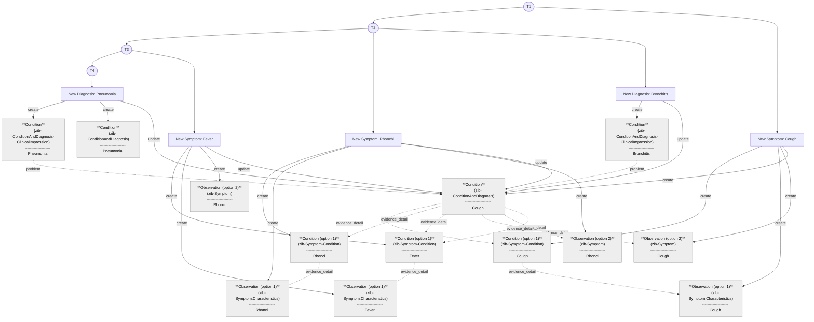
```mermaid
flowchart TB
    T1(["T1"]) --> T2(["T2"]) & Symptom_Cough["New Symptom: Cough"]
    T2 --> T3(["T3"]) & Symptom_Rhonci["New Symptom: Rhonchi"] & Diagnosis_Bronchitis["New Diagnosis: Bronchitis"]
    T3 --> T4(["T4"]) & Symptom_Fever["New Symptom: Fever"]
    Symptom_Cough -- create --> S_Cough["**Condition (option 1)**
        (zib-Symptom-Condition)
        --------------------
        Cough"] & SC_Cough["**Observation (option 1)**
        (zib-Symptom.Characteristics)
        --------------------
        Cough"] & SO_Cough["**Observation (option 2)**
        (zib-Symptom)
        --------------------
        Cough"] & CD["**Condition**
        (zib-ConditionAndDiagnosis)
        --------------------
        Cough"]
    Symptom_Rhonci -- create --> S_Rhonci["**Condition (option 1)**
        (zib-Symptom-Condition)
        --------------------
        Rhonci"] & SC_Rhonci["**Observation (option 1)**
        (zib-Symptom.Characteristics)
        --------------------
        Rhonci"] & SO_Rhonci["**Observation (option 2)**
        (zib-Symptom)
        --------------------
        Rhonci"]
    Symptom_Rhonci -- update --> CD
    Diagnosis_Bronchitis -- create --> CDCI_Bronchitis["**Condition**
        (zib-ConditionAndDiagnosis-ClinicalImpression)
        --------------------
        Bronchitis"]
    Diagnosis_Bronchitis -- update --> CD
    Symptom_Fever -- create --> S_Fever["**Condition (option 1)**
        (zib-Symptom-Condition)
        --------------------
        Fever"] & SC_Fever["**Observation (option 1)**
        (zib-Symptom.Characteristics)
        --------------------
        Fever"] & SO_Fever["**Observation (option 2)**
        (zib-Symptom)
        --------------------
        Rhonci"]
    Symptom_Fever -- update --> CD
    T4 --> Diagnosis_Longontsteking["New Diagnosis: Pneumonia"]
    Diagnosis_Longontsteking -- create --> CDCI_Pneumonia["**Condition**
        (zib-ConditionAndDiagnosis-ClinicalImpression)
        --------------------
        Pneumonia"]  & CD_Pneumonia["**Condition**
        (zib-ConditionAndDiagnosis)
        --------------------
        Pneumonia"]
    Diagnosis_Longontsteking -- update --> CD
    CD -. evidence_detail .-> S_Cough & S_Rhonci & S_Fever & SO_Cough & SO_Rhonci & S_Fever
    S_Cough -. evidence_detail .-> SC_Cough
    S_Rhonci -. evidence_detail .- SC_Rhonci
    CDCI_Bronchitis -. problem .- CD
    CDCI_Pneumonia -. problem .-> CD
    S_Fever -. evidence_detail .- SC_Fever

     S_Cough:::Ash
     SC_Cough:::Ash
     SO_Cough:::Ash
     CD:::Ash
     S_Rhonci:::Ash
     SC_Rhonci:::Ash
     SO_Rhonci:::Ash
     CDCI_Bronchitis:::Ash
     S_Fever:::Ash
     SC_Fever:::Ash
     SO_Fever:::Ash
     CD_Pneumonia:::Ash
     CDCI_Pneumonia:::Ash
    classDef Ash stroke-width:1px, stroke-dasharray:none, stroke:#999999, fill:#EEEEEE, color:#000000
```

### Flavor 2: No relationships between FHIR resources

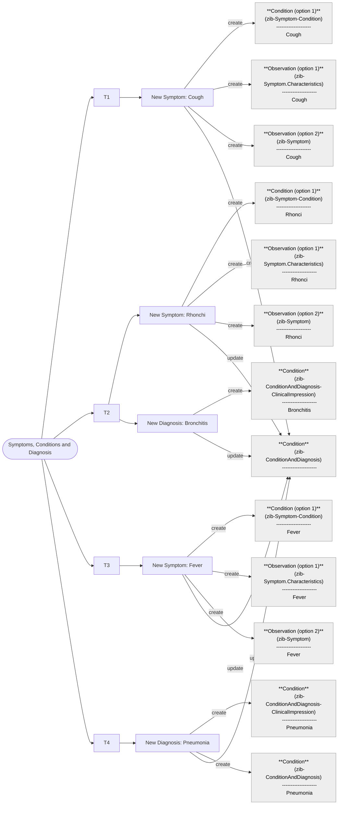
```mermaid
graph LR
    T0(["Symptoms, Conditions and Diagnosis"]) --> T1 & T2 & T3 & T4
    T1 -->  Symptom_Cough["New Symptom: Cough"]
    T2 -->  Symptom_Rhonci["New Symptom: Rhonchi"] & Diagnosis_Bronchitis["New Diagnosis: Bronchitis"]
    T3 -->  Symptom_Fever["New Symptom: Fever"]
    T4 -->  Diagnosis_Longontsteking["New Diagnosis: Pneumonia"]

    Symptom_Cough -- create --> 
        S_Cough["**Condition (option 1)**
        (zib-Symptom-Condition)
        --------------------
        Cough"] & SC_Cough["**Observation (option 1)**
        (zib-Symptom.Characteristics)
        --------------------
        Cough"] & SO_Cough["**Observation (option 2)**
        (zib-Symptom)
        --------------------
        Cough"] & CD["**Condition**
        (zib-ConditionAndDiagnosis)
        --------------------"]
   
    Symptom_Rhonci -- create --> S_Rhonci["**Condition (option 1)**
        (zib-Symptom-Condition)
        --------------------
        Rhonci"] & SC_Rhonci["**Observation (option 1)**
        (zib-Symptom.Characteristics)
        --------------------
        Rhonci"] & SO_Rhonci["**Observation (option 2)**
        (zib-Symptom)
        --------------------
        Rhonci"]
    Symptom_Rhonci -- update --> CD
    
    Diagnosis_Bronchitis -- create --> CDCI_Bronchitis["**Condition**
        (zib-ConditionAndDiagnosis-ClinicalImpression)
        --------------------
        Bronchitis"]
    Diagnosis_Bronchitis -- update --> CD

    Symptom_Fever -- create --> S_Fever["**Condition (option 1)**
        (zib-Symptom-Condition)
        --------------------
        Fever"] & SC_Fever["**Observation (option 1)**
        (zib-Symptom.Characteristics)
        --------------------
        Fever"] & SO_Fever["**Observation (option 2)**
        (zib-Symptom)
        --------------------
        Fever"]
    Symptom_Fever -- update --> CD
    
    Diagnosis_Longontsteking -- create --> CDCI_Pneumonia["**Condition**
        (zib-ConditionAndDiagnosis-ClinicalImpression)
        --------------------
        Pneumonia"] & CD_Pneumonia["**Condition**
        (zib-ConditionAndDiagnosis)
        --------------------
        Pneumonia"]
        Diagnosis_Longontsteking -- update --> CD

     S_Cough:::Ash
     SC_Cough:::Ash
     SO_Cough:::Ash
     CD:::Ash
     S_Rhonci:::Ash
     SC_Rhonci:::Ash
     SO_Rhonci:::Ash
     CDCI_Bronchitis:::Ash
     S_Fever:::Ash
     SC_Fever:::Ash
     SO_Fever:::Ash

     CD_Pneumonia:::Ash
     CDCI_Pneumonia:::Ash
    classDef Ash stroke-width:1px, stroke-dasharray:none, stroke:#999999, fill:#EEEEEE, color:#000000

```

### Flavor 3: No relationships between FHIR resources, with action descriptions
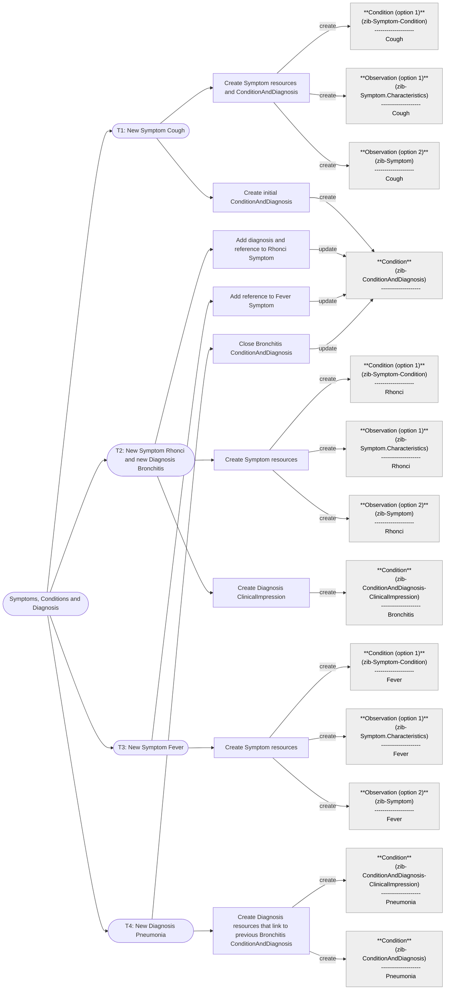
```mermaid
graph LR
    T0(["Symptoms, Conditions and Diagnosis"]) --> T1(["T1: New Symptom Cough"]) & T2(["T2: New Symptom Rhonci and new Diagnosis Bronchitis"]) & T3(["T3: New Symptom Fever"]) & T4(["T4: New Diagnosis Pneumonia"])
    T1 -->  Symptom_Cough["Create Symptom resources and ConditionAndDiagnosis"] & Initial_CD["Create initial ConditionAndDiagnosis"]
    T2 -->  Symptom_Rhonci["Create Symptom resources"] & Diagnosis_Bronchitis_CI["Create Diagnosis ClinicalImpression"] & Diagnosis_Bronchitis["Add diagnosis and reference to Rhonci Symptom"]
    T3 -->  Symptom_Fever["Create Symptom resources"] & Symptom_Fever_Reference["Add reference to Fever Symptom"]
    T4 -->  Diagnosis_Longontsteking["Create Diagnosis resources that link to previous Bronchitis ConditionAndDiagnosis"] & Close_Bronchitis["Close Bronchitis ConditionAndDiagnosis"]

    Symptom_Cough -- create --> 
        S_Cough["**Condition (option 1)**
        (zib-Symptom-Condition)
        --------------------
        Cough"] & SC_Cough["**Observation (option 1)**
        (zib-Symptom.Characteristics)
        --------------------
        Cough"] & SO_Cough["**Observation (option 2)**
        (zib-Symptom)
        --------------------
        Cough"] 
    Initial_CD -- create --> CD["**Condition**
        (zib-ConditionAndDiagnosis)
        --------------------"]
   
    Symptom_Rhonci -- create --> S_Rhonci["**Condition (option 1)**
        (zib-Symptom-Condition)
        --------------------
        Rhonci"] & SC_Rhonci["**Observation (option 1)**
        (zib-Symptom.Characteristics)
        --------------------
        Rhonci"] & SO_Rhonci["**Observation (option 2)**
        (zib-Symptom)
        --------------------
        Rhonci"] 

    
    Diagnosis_Bronchitis_CI -- create --> CDCI_Bronchitis["**Condition**
        (zib-ConditionAndDiagnosis-ClinicalImpression)
        --------------------
        Bronchitis"]
    Diagnosis_Bronchitis -- update --> CD


    Symptom_Fever -- create --> S_Fever["**Condition (option 1)**
        (zib-Symptom-Condition)
        --------------------
        Fever"] & SC_Fever["**Observation (option 1)**
        (zib-Symptom.Characteristics)
        --------------------
        Fever"] & SO_Fever["**Observation (option 2)**
        (zib-Symptom)
        --------------------
        Fever"] 

    Symptom_Fever_Reference -- update --> CD
    
    Diagnosis_Longontsteking -- create --> CDCI_Pneumonia["**Condition**
        (zib-ConditionAndDiagnosis-ClinicalImpression)
        --------------------
        Pneumonia"] & CD_Pneumonia["**Condition**
        (zib-ConditionAndDiagnosis)
        --------------------
        Pneumonia"]
        Close_Bronchitis -- update --> CD

     S_Cough:::Ash
     SC_Cough:::Ash
     SO_Cough:::Ash
     CD:::Ash
     S_Rhonci:::Ash
     SC_Rhonci:::Ash
     SO_Rhonci:::Ash
     CDCI_Bronchitis:::Ash
     S_Fever:::Ash
     SC_Fever:::Ash
     SO_Fever:::Ash
     CD_Pneumonia:::Ash
     CDCI_Pneumonia:::Ash
    classDef Ash stroke-width:1px, stroke-dasharray:none, stroke:#999999, fill:#EEEEEE, color:#000000

```

## Technical Scenario's regarding instances

### 1a. Patient has a new Symptom A (Condition)

```mermaid
flowchart TB

NewSymptom_A["`New Symptom A`"]

    CD_A["`**Condition**
        (zib-ConditionAndDiagnosis)
        --------------------
        .id = _1CD_A_`"] 

    S_A["`**Condition**
        (zib-Symptom-Condition)
        --------------------
        .id = _1S_A_`"]

    SC_A["`**Observation**
        (zib-Symptom.Characteristics)
        --------------------
        .id = _1SC_A_`"]    

    CD_A:::Ash
    S_A:::Ash
    SC_A:::Ash
    classDef Ash stroke-width:1px, stroke-dasharray:none, stroke:#999999, fill:#EEEEEE, color:#000000 

NewSymptom_A -- create --> CD_A
NewSymptom_A -- create --> S_A
NewSymptom_A -- create --> SC_A
```

### 1b. Patient has a new Symptom A (Observation)

```mermaid
flowchart TB

NewSymptom_A["`New Symptom A`"]

    CD_A["`**Condition**
        (zib-ConditionAndDiagnosis)
        --------------------
        .id = _1CD_B_`"] 

    SO_A["`**Observation**
        (zib-Symptom)
        --------------------
        .id = _1S_B_`"]  

    CD_A:::Ash
    SO_A:::Ash
    classDef Ash stroke-width:1px, stroke-dasharray:none, stroke:#999999, fill:#EEEEEE, color:#000000 

NewSymptom_A -- create --> CD_A
NewSymptom_A -- create --> SO_A
```

### 2a. Patient has a new Symptom B (Condition)
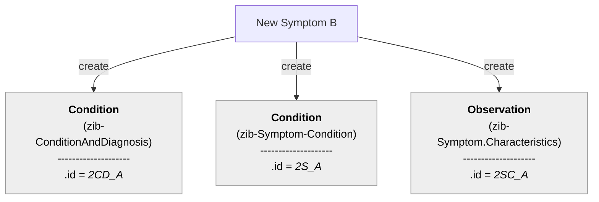
```mermaid
flowchart TB

NewSymptom_B["`New Symptom B`"]

    CD_B["`**Condition**
        (zib-ConditionAndDiagnosis)
        --------------------
        .id = _2CD_A_`"] 
    S_B["`**Condition**
        (zib-Symptom-Condition)
        --------------------
        .id = _2S_A_`"]
    SC_B["`**Observation**
        (zib-Symptom.Characteristics)
        --------------------
        .id = _2SC_A_`"]

    CD_B:::Ash
    S_B:::Ash
    SC_B:::Ash
    classDef Ash stroke-width:1px, stroke-dasharray:none, stroke:#999999, fill:#EEEEEE, color:#000000    

NewSymptom_B -- create --> CD_B
NewSymptom_B -- create --> S_B
NewSymptom_B -- create --> SC_B
```

### 2b. Patient has a new Symptom B (Observation)
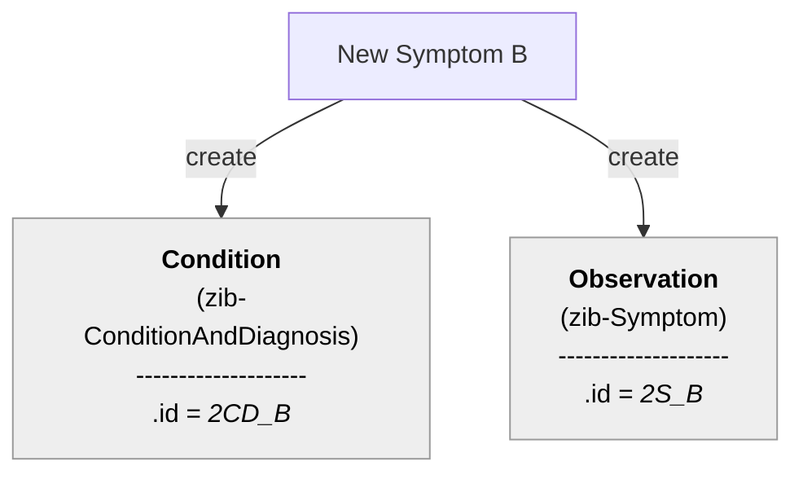
```mermaid
flowchart TB

NewSymptom_B["`New Symptom B`"]

    CD_B["`**Condition**
        (zib-ConditionAndDiagnosis)
        --------------------
        .id = _2CD_B_`"] 
    SO_B["`**Observation**
        (zib-Symptom)
        --------------------
        .id = _2S_B_`"]

    CD_B:::Ash
    SO_B:::Ash
    classDef Ash stroke-width:1px, stroke-dasharray:none, stroke:#999999, fill:#EEEEEE, color:#000000    

NewSymptom_B -- create --> CD_B
NewSymptom_B -- create --> SO_B
```

### 3a. Patient gets another Symptom C (Condition) related to the same Condition as Symptom A
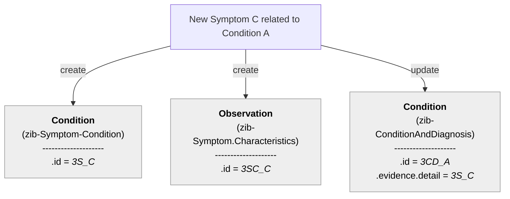
```mermaid
flowchart TB

NewSymptom_C["`New Symptom C related to Condition A`"]

    S_C["`**Condition**
        (zib-Symptom-Condition)
        --------------------
        .id = _3S_C_`"]
    SC_C["`
        **Observation**
        (zib-Symptom.Characteristics)
        --------------------
        .id = _3SC_C_
        `"]    
    CD_A["`
        **Condition**
        (zib-ConditionAndDiagnosis)
        --------------------
        .id = _3CD_A_
        .evidence.detail = _3S_C_
        `"] 
    
    S_C:::Ash
    SC_C:::Ash
    CD_A:::Ash
    classDef Ash stroke-width:1px, stroke-dasharray:none, stroke:#999999, fill:#EEEEEE, color:#000000


NewSymptom_C -- create --> S_C
NewSymptom_C -- create --> SC_C
NewSymptom_C -- update --> CD_A
```

### 3b. Patient gets another Symptom C (Observation) related to the same Condition as Symptom A

```mermaid
flowchart TB

NewSymptom_C["`New Symptom C related to Condition A`"]

    SO_C["`
        **Observation**
        (zib-Symptom)
        --------------------
        .id = _3S_C_
        `"]    
    CD_A["`
        **Condition**
        (zib-ConditionAndDiagnosis)
        --------------------
        .id = _3CD_A_
        .evidence.detail = _3S_C_
        `"] 

    
    SO_C:::Ash
    CD_A:::Ash
    classDef Ash stroke-width:1px, stroke-dasharray:none, stroke:#999999, fill:#EEEEEE, color:#000000


NewSymptom_C -- create --> SO_C
NewSymptom_C -- update --> CD_A
```

### 4a. Healthprofessional adds new recording/observation of an existing Symptom C (Condition)
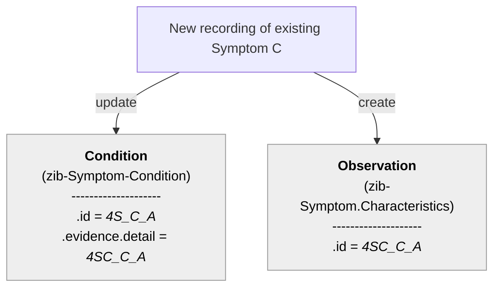
```mermaid
flowchart TB

NewSymptom_C["`New recording of existing Symptom C`"]

    S_C["`**Condition**
        (zib-Symptom-Condition)
        --------------------
        .id = _4S_C_A_
        .evidence.detail = _4SC_C_A_`"]
    SC_C["`
        **Observation**
        (zib-Symptom.Characteristics)
        --------------------
        .id = _4SC_C_A_
        `"]
    
    S_C:::Ash
    SC_C:::Ash
    classDef Ash stroke-width:1px, stroke-dasharray:none, stroke:#999999, fill:#EEEEEE, color:#000000

NewSymptom_C -- update --> S_C
NewSymptom_C -- create --> SC_C
```

### 4b. Healthprofessional adds new recording/observation of an existing Symptom C (Observation)
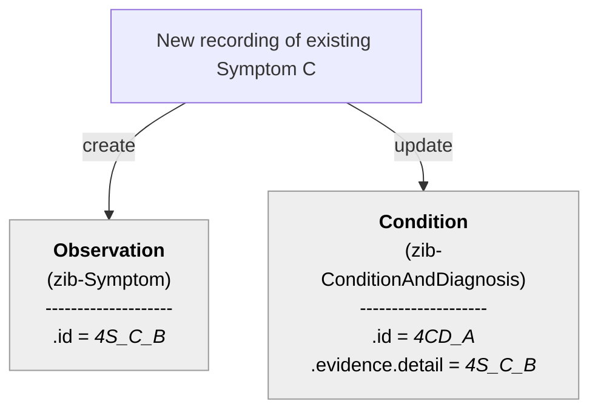
```mermaid
flowchart TB

NewSymptom_C["`New recording of existing Symptom C`"]

    SO_C["`
        **Observation**
        (zib-Symptom)
        --------------------
        .id = _4S_C_B_
        `"]
    CD_A["`
        **Condition**
        (zib-ConditionAndDiagnosis)
        --------------------
        .id = _4CD_A_
        .evidence.detail = _4S_C_B_
        `"]     
    
    SO_C:::Ash
    CD_A:::Ash
    classDef Ash stroke-width:1px, stroke-dasharray:none, stroke:#999999, fill:#EEEEEE, color:#000000

NewSymptom_C -- create --> SO_C
NewSymptom_C -- update --> CD_A
```

### 5a. Healthprofessional adds the anatomical location of symptom A (Condition)
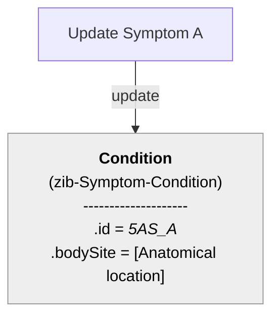
```mermaid
flowchart TB

UpdateSymptom_A["`Update Symptom A`"]
    S_A["`**Condition**
        (zib-Symptom-Condition)
        --------------------
        .id = _5AS_A_
        .bodySite = [Anatomical location]`"]
  
    S_A:::Ash
    classDef Ash stroke-width:1px, stroke-dasharray:none, stroke:#999999, fill:#EEEEEE, color:#000000

UpdateSymptom_A -- update --> S_A
```

### 5b. Healthprofessional adds the anatomical location of symptom A (Observation)
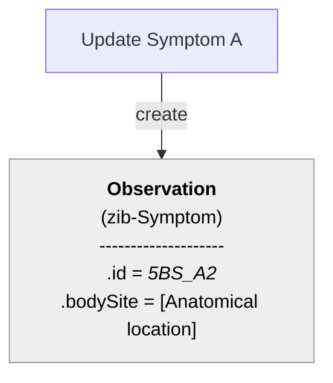
```mermaid
flowchart TB

UpdateSymptom_A["`Update Symptom A`"]
    S_A["`**Observation**
        (zib-Symptom)
        --------------------
        .id = _5BS_A2_
        .bodySite = [Anatomical location]`"]
  
    S_A:::Ash
    classDef Ash stroke-width:1px, stroke-dasharray:none, stroke:#999999, fill:#EEEEEE, color:#000000

UpdateSymptom_A -- create --> S_A
```

### 5c. Healthprofessional adds a second anatomical location of symptom A (Observation)
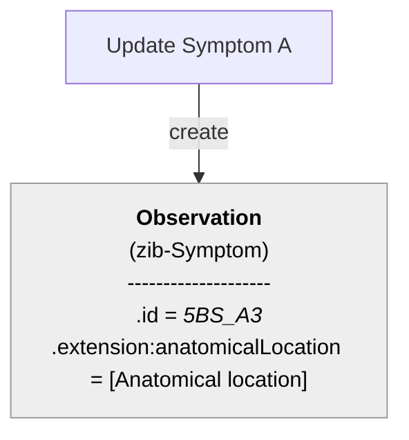
```mermaid
flowchart TB

UpdateSymptom_A["`Update Symptom A`"]
    S_A["`**Observation**
        (zib-Symptom)
        --------------------
        .id = _5BS_A3_
        .extension:anatomicalLocation = [Anatomical location]`"]
  
    S_A:::Ash
    classDef Ash stroke-width:1px, stroke-dasharray:none, stroke:#999999, fill:#EEEEEE, color:#000000

UpdateSymptom_A -- create --> S_A
```

### 6a. Symptom A (Condition) has resolved and patient gets a new Symptom D (Condition) for Condition A 

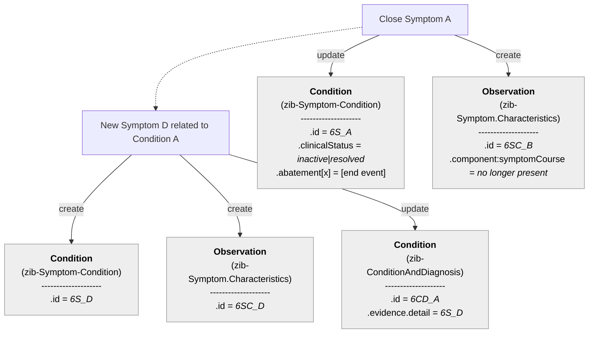
```mermaid
flowchart TB

CloseSymptom_A["`Close Symptom A`"]
NewSymptom_D["`New Symptom D related to Condition A`"]

CloseSymptom_A -.-> NewSymptom_D

    S_A["`**Condition**
        (zib-Symptom-Condition)
        --------------------
        .id = _6S_A_
        .clinicalStatus = _inactive_|_resolved_
        .abatement[x] = [end event]`"]    

    SC_B["`**Observation**
        (zib-Symptom.Characteristics)
        --------------------
        .id = _6SC_B_
        .component:symptomCourse = _no longer present_
        `"]        

    CD_A["`**Condition**
        (zib-ConditionAndDiagnosis)
        --------------------
        .id = _6CD_A_
        .evidence.detail = _6S_D_`"] 

    S_D["`**Condition**
        (zib-Symptom-Condition)
        --------------------
        .id = _6S_D_`"]
    SC_D["`**Observation**
        (zib-Symptom.Characteristics)
        --------------------
        .id = _6SC_D_`"]    

    S_A:::Ash
    SC_B:::Ash
    CD_A:::Ash
    S_D:::Ash
    SC_D:::Ash
    classDef Ash stroke-width:1px, stroke-dasharray:none, stroke:#999999, fill:#EEEEEE, color:#000000

CloseSymptom_A -- update --> S_A
CloseSymptom_A -- create --> SC_B
NewSymptom_D -- create --> S_D
NewSymptom_D -- create --> SC_D
NewSymptom_D -- update --> CD_A
```

### 6b. Symptom A (Observation) has resolved and patient gets a new Symptom D (Observation) for Condition A 

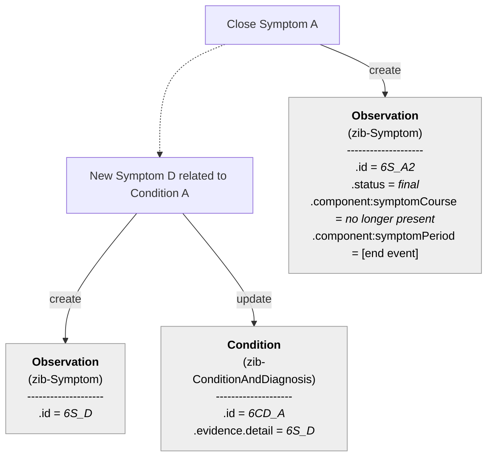
```mermaid
flowchart TB

CloseSymptom_A["`Close Symptom A`"]
NewSymptom_D["`New Symptom D related to Condition A`"]

CloseSymptom_A -.-> NewSymptom_D

    S_A["`**Observation**
        (zib-Symptom)
        --------------------
        .id = _6S_A2_
        .status = _final_
        .component:symptomCourse = _no longer present_
        .component:symptomPeriod = [end event]`"]           

    CD_A["`**Condition**
        (zib-ConditionAndDiagnosis)
        --------------------
        .id = _6CD_A_
        .evidence.detail = _6S_D_`"] 

    S_D["`**Observation**
        (zib-Symptom)
        --------------------
        .id = _6S_D_`"]   

    S_A:::Ash
    CD_A:::Ash
    S_D:::Ash
    classDef Ash stroke-width:1px, stroke-dasharray:none, stroke:#999999, fill:#EEEEEE, color:#000000

CloseSymptom_A -- create --> S_A
NewSymptom_D -- create --> S_D
NewSymptom_D -- update --> CD_A
```

### 7. Symptom A (Condition) has resolved and there is a new Diagnosis B for Condition A 

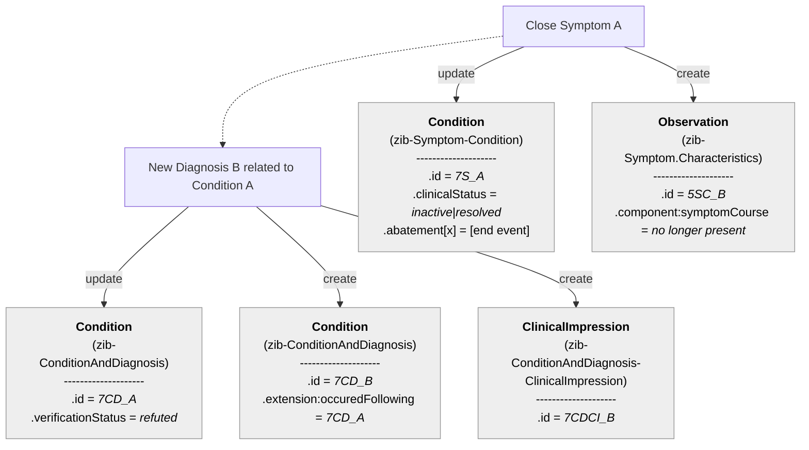
```mermaid
flowchart TB

CloseSymptom_A["`Close Symptom A`"]
NewDiagnosis_B["`New Diagnosis B related to Condition A`"]

CloseSymptom_A -.-> NewDiagnosis_B

    S_A["`**Condition**
        (zib-Symptom-Condition)
        --------------------
        .id = _7S_A_
        .clinicalStatus = _inactive_|_resolved_
        .abatement[x] = [end event]`"]    

    SC_B["`**Observation**
        (zib-Symptom.Characteristics)
        --------------------
        .id = _5SC_B_
        .component:symptomCourse = _no longer present_
        `"]            

    CD_A["`**Condition**
        (zib-ConditionAndDiagnosis)
        --------------------
        .id = _7CD_A_
        .verificationStatus = _refuted_`"]

    CD_B["`**Condition**
        (zib-ConditionAndDiagnosis)
        --------------------
        .id = _7CD_B_
        .extension:occuredFollowing = _7CD_A_`"] 
    CDCI_B["`**ClinicalImpression**
        (zib-ConditionAndDiagnosis-ClinicalImpression)
        --------------------
        .id = _7CDCI_B_`"] 

    S_A:::Ash
    SC_B:::Ash
    CD_A:::Ash
    CD_B:::Ash
    CDCI_B:::Ash
    classDef Ash stroke-width:1px, stroke-dasharray:none, stroke:#999999, fill:#EEEEEE, color:#000000

CloseSymptom_A -- update --> S_A
CloseSymptom_A -- create --> SC_B
NewDiagnosis_B -- update --> CD_A
NewDiagnosis_B -- create --> CD_B
NewDiagnosis_B -- create --> CDCI_B
```

### 8. Symptom A (Condition) has resolved along with the related condition A

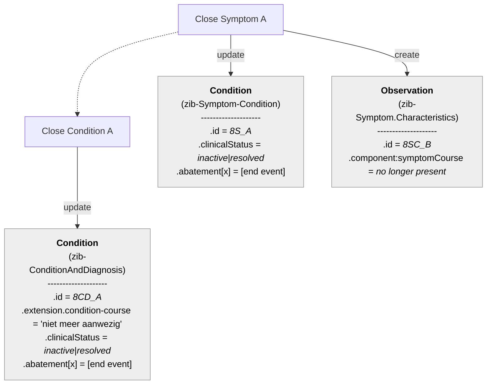
```mermaid
flowchart TB

CloseSymptom_A["`Close Symptom A`"]
CloseDiagnosis_B["`Close Condition A`"]

CloseSymptom_A -.-> CloseDiagnosis_B

    S_A["`
        **Condition**
        (zib-Symptom-Condition)
        --------------------
        .id = _8S_A_
        .clinicalStatus = _inactive_|_resolved_
        .abatement[x] = [end event]
        `"]    

    SC_B["`**Observation**
        (zib-Symptom.Characteristics)
        --------------------
        .id = _8SC_B_
        .component:symptomCourse = _no longer present_
        `"]    

    CD_B["`
        **Condition**
        (zib-ConditionAndDiagnosis)
        --------------------
        .id = _8CD_A_
        .extension.condition-course = 'niet meer aanwezig'
        .clinicalStatus = _inactive_|_resolved_
        .abatement[x] = [end event]
        `"] 
   
    S_A:::Ash
    SC_B:::Ash
    CD_B:::Ash
    classDef Ash stroke-width:1px, stroke-dasharray:none, stroke:#999999, fill:#EEEEEE, color:#000000

CloseSymptom_A -- update --> S_A
CloseSymptom_A -- create --> SC_B
CloseDiagnosis_B -- update --> CD_B
```

### 9a. Healthprofessional rules out Symptom B (Condition) for Condition A

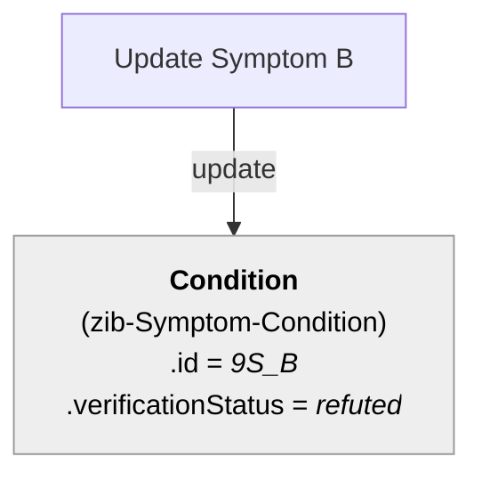
```mermaid
flowchart TB

UpdateSymptom_A["`Update Symptom B`"]

    S_A["`
        **Condition**
        (zib-Symptom-Condition)
        .id = _9S_B_
        .verificationStatus = _refuted_
        `"]    
   
    S_A:::Ash

    classDef Ash stroke-width:1px, stroke-dasharray:none, stroke:#999999, fill:#EEEEEE, color:#000000

UpdateSymptom_A -- update --> S_A

```

### 9b. Healthprofessional rules out Symptom B (Observation) for Condition A

```mermaid
flowchart TB

UpdateSymptom_A["`Update Symptom B`"]

    S_A["`
        **Observation**
        (zib-Symptom)
        .id = _9S_B_
        .status = _final_
        .interpretation = _negative_
        `"]    
   
    S_A:::Ash

    classDef Ash stroke-width:1px, stroke-dasharray:none, stroke:#999999, fill:#EEEEEE, color:#000000

UpdateSymptom_A -- create --> S_A

```

### 10. Healthprofessional modifies a single diagnosis 'Bronchitus' to a Pneumonia

```mermaid
flowchart TB

UpdateDiagnosis_A["`Update Bronchitus diagnosis`"]
CreateDiagnosis_B["`Create Pneumonia diagnosis`"]

UpdateDiagnosis_A -.-> CreateDiagnosis_B

    CD_Bronchitus["`
            **Condition**
            (zib-ConditionAndDiagnosis)
            --------------------
            .id = _10CD_Bronchitus_
            .verificationStatus = _refuted_
        `"] 
    CD_Pneumonia["`
            **Condition**
            (zib-ConditionAndDiagnosis)
            --------------------
            .id = _10CD_Pneumonia_
            .condition-occuredFollowing = _10CD_Bronchitus_
        `"] 
    CDCI_Pneumonia["`
        **ClinicalImpression**
        (zib-ConditionAndDiagnosis-ClinicalImpression)
        --------------------
        .id = _10CDCI_Pneumonia_
        `"] 
   
    CD_Bronchitus:::Ash
    CD_Pneumonia:::Ash
    CDCI_Pneumonia:::Ash
    classDef Ash stroke-width:1px, stroke-dasharray:none, stroke:#999999, fill:#EEEEEE, color:#000000

UpdateDiagnosis_A -- update --> CD_Bronchitus
CreateDiagnosis_B -- create --> CD_Pneumonia
CreateDiagnosis_B -- create --> CDCI_Pneumonia

```

### 11. Healthprofessional ruled out the DD Bronchitus and made from the DD Pneumonia the diagnosis

```mermaid
flowchart TB

UpdateDiagnosis_A["`Update Bronchitus diagnosis`"]
UpdateDiagnosis_B["`Update Pneumonia diagnosis`"]

UpdateDiagnosis_A -.-> UpdateDiagnosis_B

    CD_Bronchitus["`
            **Condition**
            (zib-ConditionAndDiagnosis)
            --------------------
            .id = _11CD_Bronchitus_
            .verificationStatus = _refuted_
        `"] 
    CD_Pneumonia["`
            **Condition**
            (zib-ConditionAndDiagnosis)
            --------------------
            .id = _11CD_Pneumonia_
            .condition-ruledOut = _11CD_Bronchitus_
            .verificationStatus = _confirmed_
        `"] 
   
    CD_Bronchitus:::Ash
    CD_Pneumonia:::Ash
    classDef Ash stroke-width:1px, stroke-dasharray:none, stroke:#999999, fill:#EEEEEE, color:#000000

UpdateDiagnosis_A -- update --> CD_Bronchitus
UpdateDiagnosis_B -- update --> CD_Pneumonia

```

### 12. Healthprofessional creates two differential disagnoses

```mermaid
flowchart TB

CreateDiagnosis["`Create two differential diagnosis`"]

    CD_DD1["`
            **Condition**
            (zib-ConditionAndDiagnosis)
            --------------------
            .id = _12CD_DD1_
            .condition-related  = _12CD_DD2_
            .verificationStatus = _differential_
        `"] 
    CD_DD2["`
            **Condition**
            (zib-ConditionAndDiagnosis)
            --------------------
            .id = _12CD_DD2_
            .condition-related  = _12CD_DD1_
            .verificationStatus = _differential_
        `"] 
    CDCI_DD1["`
        **ClinicalImpression**
        (zib-ConditionAndDiagnosis-ClinicalImpression)
        --------------------
        .id = _12CDCI_DD1_
        .problem = _12CD_DD1_
        .problem = _12CD_DD2_
        .finding = Bronchitus
        .finding = Pneumonia
        `"] 

    CD_DD1:::Ash
    CDCI_DD1:::Ash
    CD_DD2:::Ash
    classDef Ash stroke-width:1px, stroke-dasharray:none, stroke:#999999, fill:#EEEEEE, color:#000000

CreateDiagnosis -- create --> CDCI_DD1
CreateDiagnosis -- create --> CD_DD1
CreateDiagnosis -- create --> CD_DD2
```

### 13. Healthprofessional adds a third DD

```mermaid
flowchart TB

CreateDiagnosis["`Create a differential diagnosis`"]

    CD_DD1["`
            **Condition**
            (zib-ConditionAndDiagnosis)
            --------------------
            .id = _13CD_DD3_
            .condition-related  = _13CD_DD1_
            .condition-related  = _13CD_DD2_
            .verificationStatus = _differential_
        `"] 

    CDCI_DD1["`
        **ClinicalImpression**
        (zib-ConditionAndDiagnosis-ClinicalImpression)
        --------------------
        .id = _13CDCI_DD3_
        .problem = _13CD_DD3_
        .finding = Eczema
        `"] 

    CD_DD1:::Ash
    CDCI_DD1:::Ash
    classDef Ash stroke-width:1px, stroke-dasharray:none, stroke:#999999, fill:#EEEEEE, color:#000000

CreateDiagnosis -- create --> CDCI_DD1
CreateDiagnosis -- create --> CD_DD1
```

### 14. Healthprofessional establishes a new single Diagnosis A and no Symptoms are recorded (there are no previous diagnoses)

```mermaid
flowchart TB

CreateDiagnosis["`Create new single diagnosis`"]

    CD_A["`
            **Condition**
            (zib-ConditionAndDiagnosis)
            --------------------
            .id = _14CD_A_
        `"] 
    CDCI_A["`
        **ClinicalImpression**
        (zib-ConditionAndDiagnosis-ClinicalImpression)
        --------------------
        .id = _14CDCI_A_
        `"] 

   
    CD_A:::Ash
    CDCI_A:::Ash
    classDef Ash stroke-width:1px, stroke-dasharray:none, stroke:#999999, fill:#EEEEEE, color:#000000

CreateDiagnosis -- create --> CD_A
CreateDiagnosis -- create --> CDCI_A
```

### 15. Healthprofessional establishes a new DD E and no Symptoms are recorded (there are no related DD)

```mermaid
flowchart TB

CreateDiagnosis["`Create new differential diagnosis`"]

    CD_E["`
            **Condition**
            (zib-ConditionAndDiagnosis)
            --------------------
            .id = _15CD_E_
            .verificationStatus = _differential_ 
        `"] 
    CDCI_E["`
            **ClinicalImpression**
            (zib-ConditionAndDiagnosis-ClinicalImpression)
            --------------------
            .id = _15CDCI_E_
        `"] 

   
    CD_E:::Ash
    CDCI_E:::Ash
    classDef Ash stroke-width:1px, stroke-dasharray:none, stroke:#999999, fill:#EEEEEE, color:#000000

CreateDiagnosis -- create --> CD_E
CreateDiagnosis -- create --> CDCI_E
```

### 16. Healthprofessional establishes a new single Diagnosis for a Condition A with existing Symptoms

```mermaid
flowchart TB

UpdateCondition["`Update Condition A`"]
CreateClinicalImpression["`Create ClinicalImpression`"]

UpdateCondition -.-> CreateClinicalImpression

    CD_A["`
            **Condition**
            (zib-ConditionAndDiagnosis)
            --------------------
            .id = _16CD_A_
        `"] 
    CDCI_A["`
        **ClinicalImpression**
        (zib-ConditionAndDiagnosis-ClinicalImpression)
        --------------------
        .id = _16CDCI_A_
        `"] 

   
    CD_A:::Ash
    CDCI_A:::Ash
    classDef Ash stroke-width:1px, stroke-dasharray:none, stroke:#999999, fill:#EEEEEE, color:#000000

UpdateCondition -- update --> CD_A
CreateClinicalImpression -- create --> CDCI_A
```

### 17. Healthprofessional establishes a new DD for Condition A with existing Symptoms (there are no related DD)

```mermaid
flowchart TB

UpdateCondition["`Update Condition A`"]
CreateClinicalImpression["`Create ClinicalImpression`"]

UpdateCondition -.-> CreateClinicalImpression

    CD_A["`
            **Condition**
            (zib-ConditionAndDiagnosis)
            --------------------
            .id = _17CD_A_
            .verificationStatus = _differential_ 
        `"] 
    CDCI_A["`
        **ClinicalImpression**
        (zib-ConditionAndDiagnosis-ClinicalImpression)
        --------------------
        .id = _17CDCI_A_
        `"] 

   
    CD_A:::Ash
    CDCI_A:::Ash
    classDef Ash stroke-width:1px, stroke-dasharray:none, stroke:#999999, fill:#EEEEEE, color:#000000

UpdateCondition -- update --> CD_A
CreateClinicalImpression -- create --> CDCI_A
```

### 18. Healthprofessional updates the anatomical location of existing single Diagnosis A

```mermaid
flowchart TB

UpdateCondition["`Update Diagnosis A`"]


    CD_A["`
            **Condition**
            (zib-ConditionAndDiagnosis)
            --------------------
            .id = _18CD_A_
            .bodySite = [Anatomical location]
        `"] 

    CD_A:::Ash
    classDef Ash stroke-width:1px, stroke-dasharray:none, stroke:#999999, fill:#EEEEEE, color:#000000

UpdateCondition -- update --> CD_A
```

### 19. Healthprofessional updates the MethodOfConfirmation of an existing single Diagnosis

```mermaid
flowchart TB

UpdateClinicalImpression["`Update ClinicalImpression A`"]


    CDCI_A["`
        **ClinicalImpression**
        (zib-ConditionAndDiagnosis-ClinicalImpression)
        --------------------
        .id = _19CDCI_A_
        `"] 

    CDCI_A:::Ash
    classDef Ash stroke-width:1px, stroke-dasharray:none, stroke:#999999, fill:#EEEEEE, color:#000000

UpdateClinicalImpression -- update --> CDCI_A
```

### 20. All scenario's with inactivating -> RegistrationData

### 21. Adjust scenario's to include hcim Exclusion

