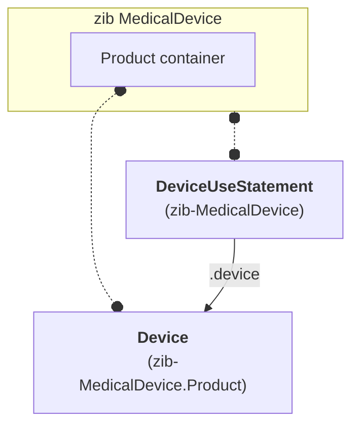

# MedicalDevice
Zib MedicalDevice and the FHIR approach for modeling medical devices don't readily fit onto each other. In particular, there are three areas to pay attention to, which will be detailed in the paragraphs below:

1. FHIR makes a distinction between the device itself and its use. This is described in the section [DeviceUseStatement and Device resources](#deviceusestatement-and-device-resources).
2. Negation of device use, particularly within the context of the International and European Patient Summary. This is described in [Alignment with the IPS/EPS](#alignment-with-the-ipseps).
3. FHIR has facilities for explicit device information which is implicitly available in the zib. This is described in [Detail level of the product id](#detail-level-of-the-product-id).

## DeviceUseStatement and Device resources
In FHIR, a distinction is made between devices or types of devices themselves, and their use by a patient; the (type of) device is represented by the Device resource, while its use is represented by the DeviceUseStatement resource.

Since the zib is about both the use of the device and the device itself (or _product_ in zib terms), the mapping onto FHIR results in two profiles, with somewhat confusing names:

* zib-MedicalDevice is the profile on the DeviceUseStatement resource. It is named this way since the DeviceUseStatement is considered the focal resource for representing zib MedicalDevice.
* zib-MedicalDevice.Product is the profile on the Device resource. It is named this way since it specifically represents the Product container of the zib.

## Alignment with the IPS/EPS
Within the context of the International Patient Summary and the European Patient Summary, DeviceUseStatement and Device are not only used for devices that are being used, but also to indicate that there are no devices in use. Specifically, the ValueSet [Absent or Unknown Devices - IPS](http://hl7.org/fhir/uv/ips/ValueSet/absent-or-unknown-devices-uv-ips) is bound on `Device.type` in the [Device-uv-ips profile](https://hl7.org/fhir/uv/ips/StructureDefinition-Device-uv-ips.html), containing the following two codes:

* _no-device-info_: to state that there is no information about the use of medical devices.
* _no-known-devices_: to state that there are no devices known to be used.

The zib cannot be used for this purpose, as it has a _required_ binding on the ProductType concept which doesn't include such codes (it _does_ include two specific negation codes, for "no visual aids" and "no hearing aids", which are present specifically for use in the context of zib VisualFunction and zib HearingFunction respectively).

To allow for this additional use, the _required_ ValueSet from the zib has been amended with the "Absent or Unknown Devices - IPS" ValueSet (and the existing negation codes for visual aids and hearing aids have been removed in favor of this more generic approach). As a result, the ValueSet bound to `Device.type` in zib-MedicalDevice.Product is wider than what the zib specifies.

## Detail level of the product id
The zib specifies the product id (concept ProductID) as one of the defining product characteristics. Frequently used 'coding systems' to identify medical devices are Health Industry Bar Code (HIBC) or GS1's Global Trade Item Number (GTIN). If one of these systems is used, the device identification happens on the basis of a UDI, which carries meaning beyond the mere identification of the device, like manufacturing date, lot number, expiration date, etc. For this reason, the zib regards the ProductID to be of type _string_ rather than an actual identifier -- although any system is allowed according to the zib.

In the FHIR Device resource, information carried within an UDI can be recorded explicitly (as well). For this reason, the ProductID is mapped onto several elements of the zib-MedicalDevice.Product profile when the identifier is a UDI. In this case, it should be recorded in `.udiCarrier.carrierHRF`, while the element `.udiCarrier.issuer` is used to indicate which 'coding system' (HIBC/GTIN) is used. Moreover the identifier may be broken down into several parts: `.udiCarrier.deviceIdentifier`, `.manufactureDate`, `.expirationDate`, `.lotNumber` and `.serialNumber`. In all cases the full identifier will be populated in `Device.identifier`. 

For GTIN, guidance is given at the respective elements in this profile and is based on <https://www.gs1.org/industries/healthcare/udi>. For HIBC please consult the [Supplier Labeling Standard](https://www.hibcc.org/udi-labeling-standards/barcode-standards/), as conversion into the several parts is less straightforward.
