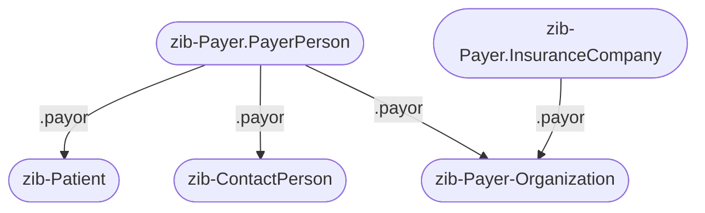

# Payer

The zib Payer is split into two focal profiles on Coverage based on the PayerPerson (NL-CM:1.1.2) and InsuranceCompany (NL-CM:1.1.3) containers (one of which must be populated in any instance of the zib Payer). These two containers cannot be profiled within one profile because they both require mapping different concepts on elements such as `.payor` and `.type`.

## PayerPerson

The zib container PayerPerson is mapped to the `zib-Payer.PayerPerson` profile on the Coverage resource and uses the profile `zib-Patient`, `zib-ContactPerson` or `zib-Payer-Organization` to capture the PayerName (NL-CM:1.1.5), AddressInformation (NL-CM:1.1.17) and ContactInformation (NL-CM:1.1.12) concepts. The former two are used if the PayerPerson represents a person, while the latter is used if the PayerPerson represents an organization. These profiles are referenced from the `zib-Payer.PayerPerson` profile using the `.payor` element.

## InsuranceCompany
The zib container InsuranceCompany is mapped to the `zib-Payer.InsuranceCompany` profile on the Coverage resource and uses the profile `zib-Payer-Organization` to capture the OrganizationName (NL-CM:1.1.16), IdentificationNumber (NL-CM:1.1.7), AddressInformation (NL-CM:1.1.17) and ContactInformation (NL-CM:1.1.12) concepts. The latter profile is referenced from the `zib-Payer.InsuranceCompany` profile using the `.payor` element.

### Relation with the Insurance (NL-CM:1.1.8) concept
If multiple insurances at the same insurance company need to be communicated (corresponding to multiple instantiated Insurance concepts), the `zib-Payer.InsuranceCompany` profile needs to be instantiated once for each insurance. All other data related to the insurance company that is not specific to a single insurance, such as the `.subscriberId` or the reference to the Organization resource on `.payor`, is duplicated in each of these instances.

Note that the `zib-Payer.InsuranceCompany` is named as such, since the zib Payer views data on the payment of supplied care from the perspective of the payers (such as insurance companies). On the other hand, the Coverage resource is constructed from the perspective of an insurance (plan). Hence, even though the name `zib-Payer.Insurance` would make more sense semantically (especially in the case of multiple insurances at the same insurance company), it is chosen to use the former name instead to align with the hierarchy of the zib data model.