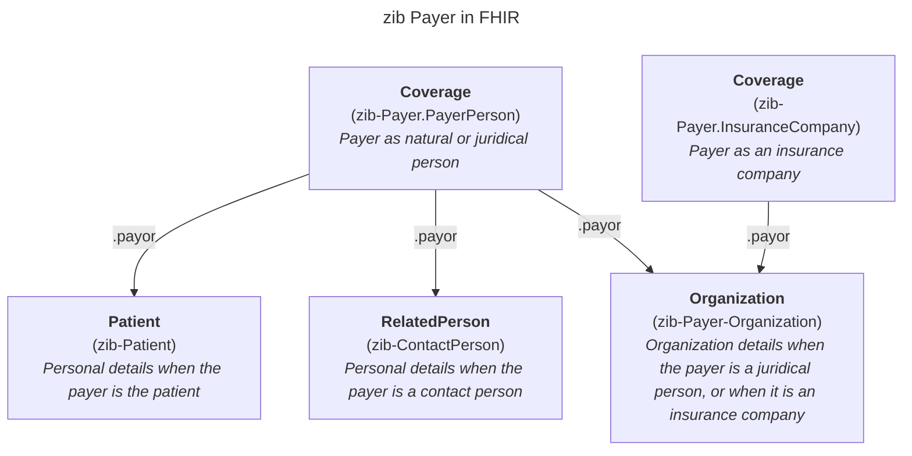
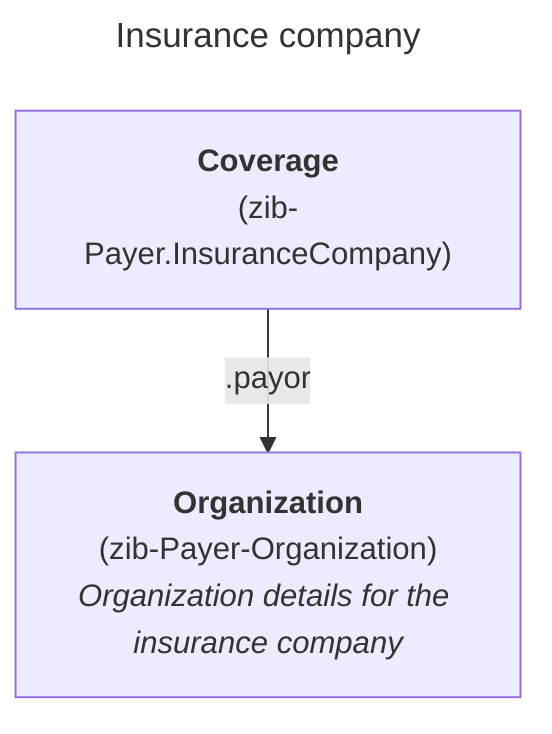
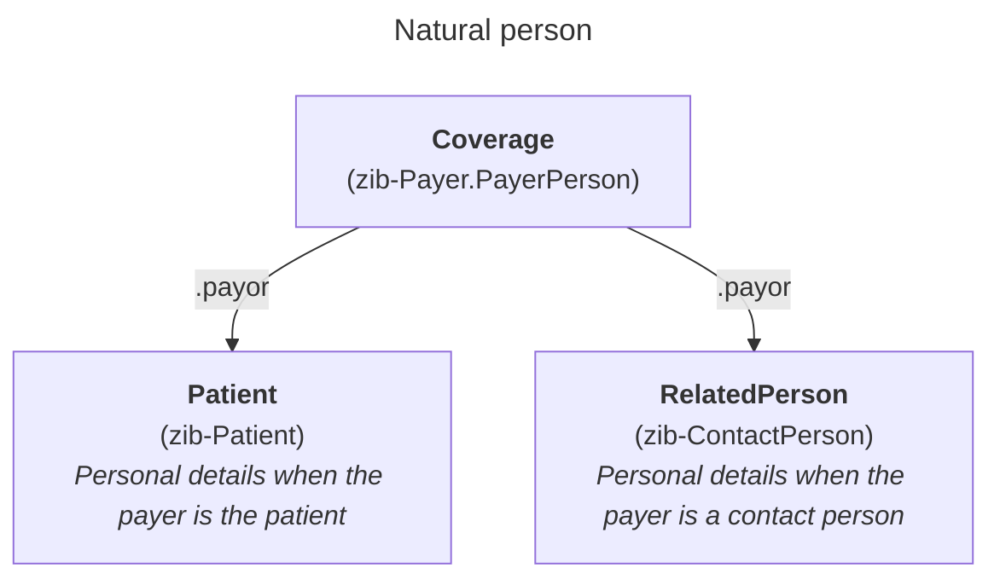
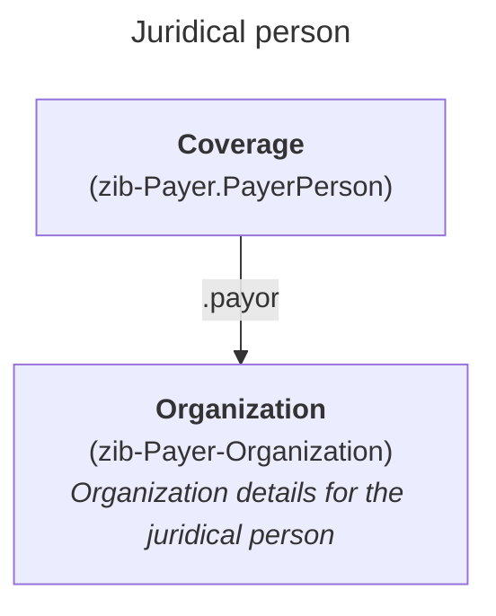

# Payer

The zib Payer recognizes different kinds of payers: on the one hand it could be an insurance company (represented by the InsuranceCompany concept, NL-CM:1.1.3), and on the other hand it could be a "person" (represented by the PayerPerson concept, NL-CM:1.1.2). Persons in turn may be natural persons, but they could also be juridical persons, i.e. organizations.

In FHIR, the Coverage resource is the focal resource to represent a payer, but details about the person or organization are communicated using Patient, RelatedPerson or Organization resource, depending on the nature of the payer. These resource are linked to the Coverage resource.

This results in two distinct Coverage profiles for zib Payer: one for representing the PayerPerson (NL-CM:1.1.2), and one for representing the InsuranceCompany (NL-CM:1.1.3). These two containers cannot be profiled within one profile because they both require mapping different concepts on elements such as `.payor` and `.type`.

## Payer as an insurance company
The zib container InsuranceCompany is mapped to the `zib-Payer.InsuranceCompany` profile on the Coverage resource. To capture details about the company (OrganizationName (NL-CM:1.1.16), IdentificationNumber (NL-CM:1.1.7), AddressInformation (NL-CM:1.1.17) and ContactInformation (NL-CM:1.1.12)), the profile `zib-Payer-Organization` on the Organization profile is used. This Organization resource is referenced from `Coverage.payor` in the `zib-Payer.InsuranceCompany` profile.

## Payer as a natural or juridical person
The zib container PayerPerson is mapped to the `zib-Payer.PayerPerson` profile on the Coverage resource. Depending on the nature of the payer, details about this natural or juridical person (PayerName (NL-CM:1.1.5), AddressInformation (NL-CM:1.1.17) and ContactInformation (NL-CM:1.1.12)) are captured in instances of:

* zib Patient (profile `zib-Patient` on the Patient resource)
* zib ContactPerson (profile `zib-ContactPerson` on the RelatedPerson resource)
* an Organization resource, represented by profile `zib-Payer-Organization`.

These resources are referenced from `Coverage.payor` in the `zib-Payer.PayerPerson` profile.

## Multiple insurances attached to the same insurance company
On the zib level, there may be multiple insurances (Insurance container, NL-CM:1.1.8) attached to a single insurance company. In FHIR however, each insurance is represented using a distinct Coverage resource. When there are multiple insurances attached to a single insurance company, each of these Coverage resources will refer the same Organization resource (`zib-Payer-Organization`) and duplicate information that is not specific to a single insurance, like `.subscriberId`.

Note that the `zib-Payer.InsuranceCompany` is named as such, since the zib Payer views data on the payment of supplied care from the perspective of the payers (such as insurance companies). On the other hand, the Coverage resource is constructed from the perspective of an insurance (plan). Hence, even though the name `zib-Payer.Insurance` would make more sense semantically (especially in the case of multiple insurances at the same insurance company), it is chosen to use the former name instead to align with the hierarchy of the zib data model.