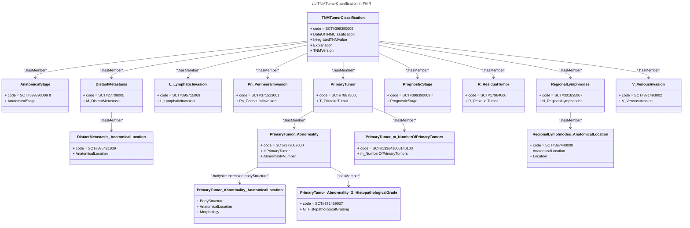

# TNMTumorClassification

Several concepts of zib TNMTumorClassification are represented using distinct Observation resources. These are grouped using the current resource and are referenced on `Observation.hasMember` as shown in the diagram below.

